# Requisite Variety — a working guide to Ashby's Law and Beer's management cybernetics

An original, rigorous, example-driven guide to one of cybernetics' few genuine theorems —
W. Ross Ashby's **Law of Requisite Variety** — and to the engineering discipline Stafford Beer
built on top of it for steering organizations: **variety engineering** and the **Viable System
Model (VSM)**. The prose is written from the primary sources; the mathematics is worked out in
full; and the claims are backed by small, runnable models you can execute with nothing but a
Python interpreter.

This is not a summary of a lecture or a video. It is a from-scratch treatment aimed at readers
who want to understand *why* the law is true, where it bites, and how a mid-20th-century idea
about brains and thermostats turned into a still-useful theory of how complex systems stay in
control.

---

## Who this is for

Engineers, researchers, and technically literate generalists. If you are comfortable with the
idea that a logarithm turns "number of possibilities" into "bits of information," you have
enough background. Everything else is built up in the text. Where the theory is genuinely
contested or informal — and parts of Beer's work are — the guide says so plainly rather than
papering over it.

---

## Orientation (start here)

**Why complexity regulation matters.** Every system that must hold something steady — body
temperature, a server's latency, an airline's schedule, a firm's cash position — faces a stream
of disturbances it did not choose. A regulator's whole job is to keep a set of *essential
variables* inside survivable limits despite that stream. The naïve intuition is that you win by
being clever, or fast, or well-funded. Cybernetics makes a sharper claim: regulation is
fundamentally a contest of *variety* — the count of distinct states a part of the world can
present. You cannot out-think a disturbance you have no distinct response to. That reframing —
from "how good is my controller?" to "how many distinguishable situations can my controller
tell apart and act on?" — is what makes the field predictive rather than merely descriptive.

**What Ashby proved.** In *An Introduction to Cybernetics* (1956), Ashby modeled regulation as a
game. A disturbance `D` takes one of several values; a regulator `R` chooses a response; a fixed
table maps each `(D, R)` pair to an outcome, and the regulator wants to force the outcome into a
small target set. Ashby's **Law of Requisite Variety** states that the variety of outcomes the
regulator can be *forced* to accept is bounded below by the variety of disturbances minus the
variety of responses. In counting form, the achievable number of distinct outcomes is at least
`V(D) / V(R)`; in Shannon's information-theoretic form, `H(outcome) ≥ H(D) − H(R)`. The
consequence is stark and exact: to drive outcome variety down to a single acceptable state, the
regulator must command at least as much variety as the disturbance. Ashby compressed the whole
result into the slogan *"only variety can destroy variety"* (Ashby, 1956). It is one of the rare
statements in the systems sciences with the status of a theorem, not a metaphor.

**What Beer built on it.** Ashby gave a law; Stafford Beer turned it into an engineering and
management practice. His insight was that any manager, regulator, or institution facing a world
of vastly higher variety than it can match has only two honest moves: **attenuate** the
incoming variety (filter, aggregate, categorize, ignore) or **amplify** its own responding
variety (delegate, automate, standardize, add channels) — and it must do enough of both to
balance the books, because the law guarantees that unabsorbed variety reappears somewhere as
loss of control. Beer's **Viable System Model** (*Brain of the Firm*, 1972; *The Heart of
Enterprise*, 1979) is a recursive architecture — five interacting subsystems, repeated at every
level of scale — engineered so that variety is absorbed as locally as possible and only the
residual reaches higher management. His maxim *"the purpose of a system is what it does"*
(Beer) is the diagnostic companion to the law: judge a regulator by the variety it actually
absorbs, not the variety it claims to.

---

## Map of the repository

### `docs/` — the guide, in order

| File | What it covers |
|------|----------------|
| [`docs/01-foundations.md`](docs/01-foundations.md) | Variety, state, and constraint. Why `log₂` converts a count of states into bits. Shannon entropy as "variety when states are unequally likely." The regulator/essential-variable picture and the block diagram every later chapter reuses. |
| [`docs/02-ashbys-law.md`](docs/02-ashbys-law.md) | The regulation game stated formally. The counting form (`V(O) ≥ V(D)/V(R)`) and the entropy form (`H(O) ≥ H(D) − H(R)`), each derived with worked arithmetic. The link to Conant & Ashby's "good regulator" theorem. Honest caveats: what the law does *not* say. |
| [`docs/03-viable-system-model.md`](docs/03-viable-system-model.md) | Beer's five systems (Operations, Coordination, Control, Intelligence, Policy), the idea of recursion, and how each channel exists to absorb a specific class of variety. Where the VSM is rigorous and where it is an informal design heuristic. |
| [`docs/04-metalanguage-metasystems.md`](docs/04-metalanguage-metasystems.md) | Why a system cannot fully regulate itself from inside — the need for a *metasystem* operating in a richer language. Connections to hierarchy, logical typing, and the recursive structure of the VSM. |
| [`docs/05-variety-engineering.md`](docs/05-variety-engineering.md) | The practical craft: attenuators and amplifiers, the variety-balance equation across a channel, and worked design examples (a help desk, a dashboard, an approval process). How to spot an unbalanced channel before it fails. |
| [`docs/06-modern-extensions.md`](docs/06-modern-extensions.md) | The law applied to contemporary systems: SRE and control loops, autoscaling, AI agents and tool-use as variety amplifiers, alert fatigue as attenuator failure. Careful about which analogies are exact and which are suggestive. |
| [`docs/07-research-frontiers.md`](docs/07-research-frontiers.md) | A guided tour of the research literature that made pieces of Ashby's law exact: information-theoretic control limits and data-rate theorems, the good regulator's descendants (internal model principle, free energy principle), empowerment, the multi-scale law of requisite variety, VSM applications, and the AI era. Every entry is a real, verified paper with a working link and an original annotation. |

### `simulation/` — executable demonstrations

Small, dependency-free Python programs that turn the arithmetic into something you can run,
perturb, and check against the theorems.

| File | What it demonstrates |
|------|----------------------|
| [`simulation/regulator_game.py`](simulation/regulator_game.py) | Ashby's regulation game, counting form. Builds a `(D, R) → outcome` table, finds the regulator's optimal strategy by exact search, sweeps `|R|`, and confirms the bound `|E| ≥ ⌈|D|/|R|⌉` — with a cyclic Latin-square construction that meets it with equality. |
| [`simulation/entropy_bound.py`](simulation/entropy_bound.py) | The information form, `H(E) ≥ H(D) − H(R)`, by Monte Carlo. A deterministic regulator makes the bound tight; a noisy regulator whose responses are uncorrelated with `D` wastes variety, leaving the residual at `H(D) − I(D;R)`. |
| [`simulation/homeostat.py`](simulation/homeostat.py) | Ashby's homeostat and ultrastability: a four-unit machine that re-randomizes its wiring whenever an essential variable leaves its survival band, restabilizing by generate-and-test with no model of the disturbance. |
| [`simulation/vsm_firm.py`](simulation/vsm_firm.py) | A toy Viable System Model firm: central, autonomous, and metasystem-augmented (S1+S3+S4) control regimes run against the same demand stream, showing the metasystem holds viability best as variety rises. |

---

## Running the simulations

Everything runs on **Python 3.10 or newer**, using **only the standard library** — no `pip
install`, no virtual environment required.

```bash
# from the repository root
python simulation/regulator_game.py
python simulation/entropy_bound.py
python simulation/homeostat.py
python simulation/vsm_firm.py
```

Each script prints its setup, the measured quantities, and the theoretical bound it is testing,
so you can read the output as a checkable proof-by-example. They are deterministic where a fixed
seed matters, and each is small enough to read end-to-end in a few minutes.

---

## A one-minute taste of the arithmetic

The law is easiest to trust once you have watched the numbers fail to cheat. Suppose the
disturbance takes three equally likely values, so its variety is `3` and its entropy is

```
H(D) = log₂ 3 ≈ 1.585 bits.
```

Give the regulator only **two** distinct responses, so `H(R) ≤ log₂ 2 = 1 bit`. The law bounds
the best achievable outcome entropy:

```
H(O) ≥ H(D) − H(R) = 1.585 − 1 = 0.585 bits > 0.
```

Because `H(O)` cannot reach `0`, no strategy — however clever — can pin the outcome to a single
acceptable state. The regulator is out-varied, and the residual `0.585` bits show up as
irreducible uncertainty in the thing you were trying to keep constant. Add a third response so
`H(R) = log₂ 3`, and the bound relaxes to `H(O) ≥ 0`: control becomes *possible* (though not
guaranteed — the response table still has to match the right move to each disturbance).
`simulation/regulator_game.py` runs exactly this and prints the measured entropies alongside
the bound.

```mermaid
flowchart LR
    D[Disturbance<br/>variety V&#40;D&#41;] --> S[System / regulated table]
    R[Regulator<br/>variety V&#40;R&#41;] --> S
    S --> O[Essential variables<br/>held in target set?]
    G[Goal: keep O in range] -.-> R
    O -. feedback .-> R
```



---

## How this repository advances the material

Most accessible treatments of requisite variety stop at the slogan. This repository does three
things beyond that:

1. **It formalizes the law with worked entropy arithmetic.** Both the counting form and the
   information-theoretic form are derived step by step, with numeric examples, so the inequality
   stops being a quotable phrase and becomes something you can compute and falsify.
2. **It provides executable demonstrations.** The `simulation/` models let you build a
   regulation game, starve the regulator of variety, and watch the bound hold — turning the
   theorems into experiments you can rerun with different disturbance distributions and response
   sets.
3. **It extends the framework to modern domains.** `docs/06` maps the law onto site reliability
   engineering (control loops, autoscaling, alerting) and onto AI agents, where tools and
   subagents function as variety amplifiers and context windows as attenuators — while flagging
   which of these mappings are exact and which are useful analogies.
4. **It connects the classical law to the live research frontier.** `docs/07` is a verified
   survey of the literature that took Ashby's slogan and made parts of it exact — information-
   theoretic control limits and the thermodynamics of feedback, communication data-rate
   theorems, the internal model principle and free energy principle, empowerment, the multi-scale
   law of requisite variety, real VSM applications, and current AI-safety and oversight work. Every
   paper is a real, checked publication with a working link and an original annotation explaining
   how it sharpens or generalizes the classical bound.

The aim throughout is rigor with honesty: state the theorem where a theorem exists, mark the
heuristic where only a heuristic exists, and never let a good metaphor stand in for a proof.

---

## License

- **Code** (everything in `simulation/` and any other source files): **MIT License**.
- **Prose and documentation** (this README and everything in `docs/`): **Creative Commons
  Attribution 4.0 International (CC BY 4.0)**.

You may reuse the code freely under MIT, and reuse or adapt the text under CC BY 4.0 provided
you give appropriate credit.

---

## Primary sources

- Ashby, W. Ross. *An Introduction to Cybernetics.* Chapman & Hall, 1956. (Definition of variety; the Law of Requisite Variety, Chapter 11.)
- Ashby, W. Ross. *Design for a Brain: The Origin of Adaptive Behaviour.* 2nd ed., Chapman & Hall, 1960.
- Shannon, Claude E. "A Mathematical Theory of Communication." *Bell System Technical Journal*, vol. 27, 1948, pp. 379–423 and 623–656. (Entropy `H`.)
- Conant, Roger C., and W. Ross Ashby. "Every Good Regulator of a System Must Be a Model of That System." *International Journal of Systems Science*, vol. 1, no. 2, 1970, pp. 89–97.
- Beer, Stafford. *Brain of the Firm.* Allen Lane / Herder and Herder, 1972 (2nd ed., Wiley, 1981).
- Beer, Stafford. *The Heart of Enterprise.* Wiley, 1979.
- Beer, Stafford. *Diagnosing the System for Organizations.* Wiley, 1985.
- Wiener, Norbert. *Cybernetics: or Control and Communication in the Animal and the Machine.* MIT Press, 1948.
