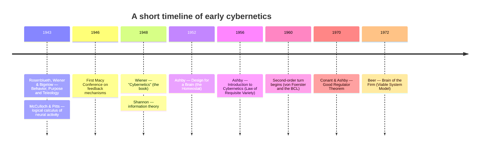
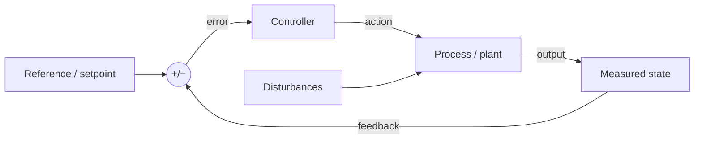
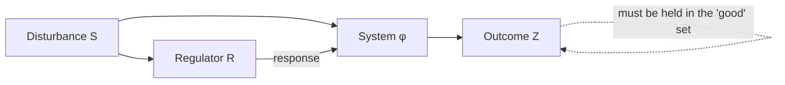

# Foundations of Cybernetics

> Part 1 of an educational series on cybernetics, requisite variety, and management cybernetics.

Cybernetics is the science of goal-directed systems: how a thing — an organism, a
machine, a firm, an ecosystem — senses what is happening, compares it to what it
"wants," and acts to close the gap. Its founders were interested less in what
systems are made of than in what they *do*, and specifically in a pattern that
recurs across biology, engineering, and society: **circular causality**, where the
consequences of an action loop back to shape the next action. That single idea —
that cause and effect can chase each other around a loop rather than running in a
straight line — turns out to be enough to build a surprisingly general theory of
regulation, adaptation, and purpose.

This document lays the groundwork for the rest of the series. It defines the field,
sketches its origins and its cast of characters, develops the core technical
vocabulary (feedback, homeostasis, black boxes, variety, regulation), states and
motivates the **Good Regulator Theorem**, distinguishes first- from second-order
cybernetics, and closes with an honest account of why cybernetics collapsed as an
institution even as its ideas quietly conquered half a dozen other fields.

---

## 1. What is cybernetics?

Norbert Wiener coined the name in 1948 in the subtitle of his book: *control and
communication in the animal and the machine*. He took the word from the Greek
*kybernētēs*, the **steersman** of a boat — the same root that gives us "governor"
(via Latin *gubernator*). The choice is not decorative. A helmsman holding a course
against wind and current is the canonical cybernetic act: continuous sensing of
deviation, continuous correction, a goal maintained not by brute force but by a
tight loop between perception and action.

Two features of the definition deserve emphasis:

- **Control *and* communication.** Regulation is impossible without information
  moving through the system. To correct a deviation you must first detect it, which
  means a signal about the current state must travel from where it is measured to
  where the decision is made. Cybernetics treats control as an *informational*
  problem, which is why it grew up alongside — and borrowed heavily from —
  information theory.
- **The animal *and* the machine.** The claim that startled Wiener's contemporaries
  was that the *same mathematics* describes a thermostat, a servomotor, a spinal
  reflex, and a predator tracking prey. Cybernetics is deliberately
  **substrate-independent**: it studies the *organization* of a system — its loops,
  its couplings, its information flows — and treats the physical implementation
  (neurons vs. vacuum tubes vs. gears) as a detail.

A compact modern gloss: **cybernetics is the study of systems that regulate
themselves by feedback toward a goal, described in terms of information and
organization rather than material.**

It is worth separating cybernetics from two neighbors it is often confused with.
**Control theory** (the engineering discipline of stability, transfer functions, and
optimal control) is in one sense a rigorous, quantitative *subset* of the cybernetic
program — the part that got fully mathematized. **General systems theory** (von
Bertalanffy) shares cybernetics' ambition of cross-domain laws but centers on
hierarchy, openness, and organization in general, without feedback and information
as its load-bearing concepts. Cybernetics is the branch obsessed specifically with
the *loop*.

---

## 2. Origins: war work and the Macy Conferences

Cybernetics did not emerge from a university department. It condensed out of World
War II research and a series of remarkable interdisciplinary meetings.

### The wartime seed

During the war Wiener worked on the problem of **anti-aircraft fire control**: how to
aim a gun at an aircraft that is taking evasive action, given that the shell takes
seconds to arrive and the target will have moved. This is a prediction-and-tracking
problem, and it forced Wiener to think of the gunner-plus-servo-plus-target as a
single coupled system with feedback. The statistical theory of prediction and
filtering he developed (the *Wiener filter*) is a direct ancestor of modern
estimation and control.

The conceptual leap came in a short 1943 paper by Arturo Rosenblueth, Wiener, and
Julian Bigelow, *Behavior, Purpose and Teleology*. Their argument: **"purpose" is not
mystical.** A system exhibits purposeful behavior precisely when it is organized as a
negative-feedback loop that reduces the gap between a current state and a target
state. This rehabilitated teleological language — *goals*, *ends*, *striving* — as
respectable engineering, by grounding it in a mechanism. In the same year McCulloch
and Pitts published *A Logical Calculus of the Ideas Immanent in Nervous Activity*,
showing that idealized neurons could compute logical propositions — the first bridge
between brains and computation. These two 1943 papers are often taken as the
intellectual birth of the field.

### The Macy Conferences (1946–1953)

The **Josiah Macy Jr. Foundation** sponsored a series of ten conferences in New York
that gave cybernetics its interdisciplinary shape. Chaired by the neurophysiologist
**Warren McCulloch**, the meetings were later titled *Cybernetics: Circular Causal and
Feedback Mechanisms in Biological and Social Systems* — a mouthful that nonetheless
names the whole program.

What made the Macy meetings unusual was the guest list. In one room you might find:

- mathematicians and engineers (Wiener, John von Neumann, Bigelow, Claude Shannon),
- neurophysiologists and psychiatrists (McCulloch, Ralph Gerard, W. Ross Ashby as a
  visitor),
- psychologists (Kurt Lewin early on),
- and — crucially — **social scientists**: the anthropologists **Gregory Bateson** and
  **Margaret Mead**, who saw in feedback a way to talk rigorously about culture,
  communication, and social regulation.

The conferences were where the vocabulary was hammered out and, just as importantly,
where the ambition was set: a *general* science of communication and control spanning
machines, organisms, minds, and societies. The historian Steve Heims' account (*The
Cybernetics Group*, 1991) documents both the intellectual excitement and the
disciplinary tensions that this breadth created — tensions that would later
contribute to the field's fragmentation.

---

## 3. The key figures

Cybernetics was made by individuals with unusually wide reach. A brief who's-who,
with the contribution each is most load-bearing for in this series:

**Norbert Wiener (1894–1964).** Mathematician (MIT), child prodigy, and the field's
namer and popularizer. Beyond the fire-control work and the 1948 book, his *The Human
Use of Human Beings* (1950) worried early and publicly about automation, information,
and the social consequences of feedback machines.

**W. Ross Ashby (1903–1972).** British psychiatrist and the field's most rigorous
theorist of regulation. He built the **Homeostat**, a machine that actively restored
its own equilibrium, and formulated the **Law of Requisite Variety** — the
centerpiece of this series. His two books, *Design for a Brain* (1952) and *An
Introduction to Cybernetics* (1956), are still the clearest formal statements of the
core theory. Where Wiener gestured at generality, Ashby delivered theorems.

**Warren McCulloch (1898–1969).** Neurophysiologist, philosopher, chair of the Macy
Conferences, and co-author (with the logician **Walter Pitts**) of the 1943 neural
calculus. He held the field together socially and pushed the brain-as-computer
research program that fed directly into artificial intelligence and neural networks.

**Claude Shannon (1916–2001).** Not a cybernetician by self-identification, but his
1948 *Mathematical Theory of Communication* supplied the quantitative backbone the
field needed. Shannon's **entropy** — a measure of uncertainty in bits — is
mathematically the same object as Ashby's **variety** (the log of the number of
distinguishable states). Whenever cybernetics counts "how many things could happen,"
it is speaking Shannon's language. Shannon attended the Macy meetings and his
influence is everywhere in the treatment of regulation as an information problem.

**Heinz von Foerster (1911–2002).** Austrian-American physicist who edited the later
Macy proceedings and ran the **Biological Computer Laboratory (BCL)** at the
University of Illinois. He is the principal architect of **second-order cybernetics**
— the reflexive turn in which the observer is folded into the system being described
(see §7). He gave the field its most quoted slogan about self-reference: the
"cybernetics of cybernetics."

**Stafford Beer (1926–2002).** British operations researcher who carried cybernetics
into management. He built the **Viable System Model (VSM)**, a recursive anatomy of any
organization capable of surviving in a changing environment, and famously attempted a
real-time cybernetic economy in Salvador Allende's Chile (**Project Cybersyn**,
1971–1973). Beer is the reason this series treats requisite variety not as an
abstraction but as an operational tool for designing institutions. His aphorism —
"the purpose of a system is what it does" (POSIWID) — insists we judge systems by
behavior, not stated intent.

Honorable mentions who recur later: **Gregory Bateson** and **Margaret Mead**
(cybernetics of mind, culture, and communication), **Gordon Pask** (conversation
theory, learning machines), **W. Grey Walter** (autonomous robot "tortoises"), and
**Humberto Maturana** and **Francisco Varela** (autopoiesis — the self-production of
living systems — a foundation of the second-order view).

---

## 4. Core concept: feedback

**Feedback** is the routing of a system's output back to its input so that the system
acts on information about the consequences of its own behavior. It comes in two
flavors, and the distinction is fundamental.

- **Negative (balancing) feedback** *opposes* deviation. The loop measures the error
  between the actual state and a reference (setpoint) and acts to shrink it. This is
  the mechanism of **stability, regulation, and goal-seeking**: thermostats, cruise
  control, the pupil reflex, blood-glucose regulation, a firm cutting prices when
  inventory piles up. "Negative" refers to the *sign* of the correction, not to
  anything undesirable — negative feedback is the good kind if you want control.
- **Positive (reinforcing) feedback** *amplifies* deviation. Output feeds back to push
  the system further in the direction it is already going: compound interest, viral
  spread, a microphone/speaker howl, arms races, network effects. Positive feedback
  drives **growth, runaway, and phase change**, and left unchecked it destroys
  equilibrium. Real systems are typically webs of both, with negative loops keeping
  positive ones from exploding.

A minimal negative-feedback controller:

The controller never needs to "understand" the process in a rich sense; it only needs
to reduce the error signal. This is the deep reason a $3 thermostat can hold a room's
temperature against weather it cannot predict: it does not model the weather, it just
keeps cancelling the error the weather produces. (§6 will show the surprising limit of
this "you don't need a model" intuition.)

Two caveats worth stating plainly:

- **Delay is dangerous.** If the feedback about the error arrives late, the corrective
  action can arrive out of phase and *amplify* oscillation instead of damping it. Much
  of classical control theory is about the stability conditions that keep delayed
  negative feedback from turning into sustained oscillation.
- **Gain must be tuned.** Too little corrective gain and the system responds
  sluggishly; too much and it overshoots and rings. The art of regulation is
  quantitative, not just structural.

---

## 5. Core concepts: homeostasis, black boxes, variety, regulation

### Homeostasis

The physiologist Walter Cannon coined **homeostasis** (in *The Wisdom of the Body*,
1932) for the body's maintenance of its internal milieu — temperature, pH, blood
sugar, osmotic pressure — within narrow survivable bounds despite external upheaval.
Ashby generalized it. He defined a set of **essential variables** that must stay
within physiological limits for the system to remain viable, and defined an adaptive
system as one that acts to keep those variables in range.

His **Homeostat** (1948) made the idea concrete and slightly uncanny: a device of four
interconnected units that, when disturbed, searched — by stepping through internal
configurations — until it found a wiring that restored equilibrium. Crucially it could
do this even for disturbances its designer had not anticipated, because it was not
executing a fixed response but *hunting for stability*. Ashby called this deeper
capacity **ultrastability**: not just a loop that corrects errors, but a system that
can *reorganize the loop itself* when its current organization fails to cope. That is
the germ of a theory of adaptation and learning.

### The black box

The **black box** is a method as much as an object. Faced with a system whose internals
you cannot (or should not) open, you can still learn its behavior by systematically
varying its **inputs** and recording its **outputs**, building up a description of the
input-output relation. Ashby made this a formal tool: much of what we can know about a
system is exactly what a diligent experimenter could extract from the black box, and no
more. This posture — study the transformation, stay agnostic about the mechanism — is
liberating (it lets you compare a brain and a machine on equal terms) and humbling (two
different internal mechanisms can be behaviorally indistinguishable, so input-output
data alone cannot always pin down what is inside).

### Variety

**Variety** is cybernetics' fundamental measure of complexity: **the number of
distinguishable states a system (or a set, or a signal) can be in.** A traffic light
has a variety of 3; a byte has a variety of 256. Measured in bits, variety is
`log2(number of states)` — literally Shannon's information measure applied to the state
space. Variety is what regulation has to cope with: the disturbances hitting a system
have variety (the many different ways things can go wrong), and the regulator has
variety (the many different responses it can make).

The reason variety matters so much is Ashby's **Law of Requisite Variety**, the subject
of the next document in this series, summarized by his own line:

> "Only variety can destroy variety." — W. Ross Ashby

Informally: to hold an outcome steady against a source of disturbance, a regulator must
command *at least as much variety* as the disturbance it faces. A regulator with fewer
distinct responses than the environment has distinct challenges will necessarily let
some disturbances through. Every genuine act of control is, at bottom, one variety
absorbing another. We develop this formally — with the counting argument and its
worked examples — in `02`.

### Regulation

**Regulation** ties the previous concepts together: it is the activity of keeping a
system's essential variables within acceptable limits despite disturbances, by
deploying requisite variety through feedback. A regulator is *good* to the extent that
it keeps the outcome in the "acceptable" set no matter what the environment throws at
it — equivalently, to the extent that it *reduces the variety of outcomes* to near
zero even while the variety of disturbances remains high. Perfect regulation would mean
the essential variables never leave their target range at all, whatever happens.

---

## 6. The Good Regulator Theorem (Conant & Ashby, 1970)

One of cybernetics' most cited and most *over*-cited results is the theorem Roger
Conant and Ross Ashby published in 1970, whose title is also its statement:

> **Every good regulator of a system must be a model of that system.**

It is a striking claim: it says that *effective control implicitly requires an internal
model of what is being controlled*. Where §4 suggested a thermostat needs no model, the
Good Regulator Theorem shows the precise sense in which a *sufficiently good* regulator
of a *sufficiently rich* system must, in effect, contain a model of it. Let us set it up
carefully, because both the strength and the fine print matter.

### The setup

There is a system with three coupled pieces:

- a set of **disturbances** `S` — the different states the environment can present (the
  "problem" the regulator faces);
- a **regulator** `R`, which observes the situation and selects a response;
- an **outcome** `Z`, which depends jointly on the disturbance and the regulator's
  response, `Z = φ(S, R)`.

We care about the outcomes: some values of `Z` are "good" (essential variables in
range) and some are "bad." The regulator's job is to choose its response, as a function
of what it sees, so that the outcome lands in the good set as often — as *reliably* — as
possible. In information terms, a good regulator **minimizes the entropy (variety) of the
outcome `Z`**: it makes the result predictable and confined, ideally to a single
acceptable value, no matter which disturbance arrives.

### An intuitive proof sketch

Think of the regulator as a lookup rule: "when I observe disturbance `s`, I emit
response `r`." The theorem asks what rule minimizes the spread (entropy) of outcomes.

1. **Fix a disturbance `s`.** For that specific `s`, the outcome depends only on the
   regulator's choice `r`, because `Z = φ(s, r)`. Among the available responses, some
   land `Z` in the good set and some don't. To make the outcome *certain* (zero spread)
   for this `s`, the regulator should pick **one** response that yields a good outcome —
   and, for minimum outcome entropy, ideally always the *same* good outcome value.

2. **A wavering regulator injects variety.** Suppose that for a given `s` the regulator
   sometimes emits `r₁` and sometimes `r₂`, and these lead to *different* outcomes. Then
   even holding the environment fixed, the outcome now has spread that comes entirely
   from the regulator's own indecision. That is self-inflicted outcome variety, and it
   can only make `Z` less predictable. So an optimal regulator must be
   **deterministic**: exactly one response per observed situation. (This is the crux —
   optimal regulation forbids the regulator from being noisier than the problem
   requires.)

3. **Determinism means the regulator is a mapping from system states to responses.**
   Once the response is a single-valued function of the situation, the regulator *is* a
   function `h: S → R`. And because the outcome we want is itself determined by the
   system's state, this required mapping is fixed by the structure of the
   system-plus-goal: the regulator's internal state must stand in one-to-one
   correspondence with the distinctions in the system that matter for the outcome.

4. **A map that mirrors the system's relevant distinctions is a model of it.** That is
   the whole content of the word "model" here: a homomorphism, a structure-preserving
   correspondence between the regulator's states and the system's states. If two
   different system situations require different regulator responses, the regulator must
   distinguish them; if they require the same response, it may lump them together. The
   optimal regulator's internal organization is therefore an image of the system's
   organization — it *models* the system, whether or not its designer intended it to.

Put in one sentence: **to make outcomes reliably good you must respond differently to
situations that demand different responses, and the internal machinery that reliably
draws exactly those distinctions is, by definition, a model of the system.**

### Honest caveats

This theorem is real and important, but it is often stretched past what it proves. Keep
the fine print in view:

- **"Model" is minimal.** The proof guarantees a *homomorphic image* — a structure that
  makes the right distinctions — not a rich, explicit, human-legible simulation. A
  lookup table that happens to draw the correct distinctions satisfies the theorem. So
  "must be a model" is much weaker than "must contain a world-simulator." Beware
  inflating it into a grand claim about minds or intelligence.
- **It assumes optimality and simplicity.** The result characterizes the *best* (minimum
  outcome-entropy) regulator that is also *no more complex than necessary*. A mediocre
  regulator need not be a good model; the theorem describes the ideal it would have to
  approach. Real regulators are approximate, and the "model" they embody is
  correspondingly partial.
- **It minimizes outcome variety, not an arbitrary loss.** The classic proof is framed
  in terms of entropy of the outcome. Recasting "good regulation" as some other
  objective (expected utility, worst-case loss) changes the details, and several later
  authors have questioned how much the entropy framing does the work.
- **Perfect regulation and the observability twist.** There is a well-known subtlety: a
  *perfect* regulator that completely cancels disturbances can make the outcome carry no
  information about the disturbance — which is why building the model from outcome data
  alone can be circular. The model has to key off the disturbance/system state, not off
  the (deliberately flattened) outcome.

Even with these qualifications, the theorem earns its place: it is the sharpest
available statement of the intuition that **you cannot reliably control what you cannot,
in some internal sense, represent.** The rhyme with modern ideas — internal models in
control engineering, world models in reinforcement learning, predictive processing and
the free-energy principle in neuroscience — is not accidental. Those fields keep
rediscovering, in their own vocabularies, that competent regulation implies an internal
model.

---

## 7. First- versus second-order cybernetics

By the 1970s the field had split its self-understanding into two "orders."

**First-order cybernetics** is the *cybernetics of observed systems*. The scientist
stands outside the system — the servomechanism, the organism, the market — and
describes its loops, its stability, its variety, as objective facts. The observer is a
neutral onlooker; the thermostat is over there being studied. Almost everything in
sections 1–6 above is first-order.

**Second-order cybernetics** — championed by **Heinz von Foerster**, with roots in
Margaret Mead's insistence that observers of social systems are *inside* them — is the
*cybernetics of observing systems*. Its move is reflexive: **the observer is part of
the system being described.** When you study a family, you affect it; when you model an
economy, your model can change behavior; a scientist's own nervous system is itself a
cybernetic system doing the observing. So the theory must account for the theorist. This
is the "cybernetics of cybernetics."

Three ideas cluster here:

- **Reflexivity / self-reference.** Systems that observe and model themselves — and
  theories that must include their own theorists — cannot be handled by pretending the
  observer is outside.
- **Autopoiesis** (Maturana and Varela): living systems are defined by *continuously
  producing themselves* — the components maintain the network of processes that in turn
  produces those components. Identity is a self-maintaining loop, not a fixed structure.
- **Radical constructivism** (Ernst von Glasersfeld): what an observer "knows" is
  constructed by that observer's own operations rather than read off a pre-given world;
  knowledge is what *works* (viable), not a mirror of reality.

The second-order turn is intellectually deep and connects cybernetics to epistemology,
biology of cognition, and the sociology of knowledge. It is also, candidly, where the
field's rigor became more contested: some second-order writing is genuinely profound,
some is loose and hard to test, and the drift toward philosophy is one reason
"cybernetics" lost cachet in engineering circles even as it gained a following in
design, therapy, and social theory. A fair reading keeps both: first-order gives you
theorems you can compute with; second-order reminds you that the modeler is never
outside the model — a caution the Good Regulator Theorem, read carefully, already hints
at.

---

## 8. Why the field faded — and why its ideas won

By the 1970s "cybernetics" was fading as a named discipline in the English-speaking
world. There is no cybernetics department at most universities; the word survives mainly
as a prefix ("cyber-") whose meaning has drifted to "internet-related," which would have
baffled Wiener. Yet almost every substantive idea the field produced is now mainstream —
just under other names. Both facts are true, and the tension between them is instructive.

**Why it faded institutionally:**

- **Overreach and vagueness.** A science of *everything with a feedback loop* is a
  science with no natural boundary. The same breadth that made the Macy meetings
  exciting made cybernetics hard to fund, staff, and teach as a coherent department. A
  field that explains everything risks owning nothing.
- **Absorption by its own children.** The rigorous, quantitative core hardened into
  **control engineering** and **information theory**, which became large self-standing
  disciplines with their own journals and chairs. Once the tractable parts had good
  homes, the residual "cybernetics" was the harder, fuzzier remainder.
- **The rise of AI as a rival banner.** The 1956 Dartmouth workshop gave "artificial
  intelligence" a crisp, ambitious brand centered on *symbolic reasoning and
  problem-solving*, which pulled talent, funding, and the "thinking machines" narrative
  away from the feedback-and-adaptation framing. For decades the symbolic program
  eclipsed the neural, adaptive lineage cybernetics had nurtured.
- **The reflexive/philosophical drift.** As §7 noted, the second-order turn, whatever
  its merits, moved part of the community away from the engineering mainstream and its
  standards of testability.
- **Cold War and countercultural static.** The word acquired connotations — from
  military command-and-control on one side to 1970s counterculture and, later, "Project
  Cybersyn"-style political projects on the other — that made it read as either dated or
  fringe rather than as a live technical field.

**Why the ideas won anyway** — the concepts dispersed into the disciplines that could
carry them:

- **Control theory & robotics.** Wiener's prediction/filtering lineage runs straight to
  the Kalman filter, state-space control, and the feedback controllers in every vehicle,
  aircraft, power grid, and factory. This *is* cybernetics, fully mathematized.
- **AI and machine learning.** The McCulloch–Pitts neuron is the ancestor of the
  perceptron and of today's deep networks; **reinforcement learning** is, structurally,
  adaptive feedback control with a reward signal; and "world models" in RL restate the
  Good Regulator intuition. The adaptive, learning-from-consequences vision that
  symbolic AI sidelined is now dominant.
- **Systems biology & neuroscience.** Homeostasis and its successors (allostasis,
  set-point regulation) are core physiology; **predictive coding** and the **free-energy
  principle** cast the brain itself as a regulator that minimizes surprise by carrying an
  internal model — cybernetics in twenty-first-century dress.
- **Organizational theory & management.** Beer's Viable System Model, systems thinking,
  Senge's "learning organization," feedback-centric views of firms and economies, and
  the whole vocabulary of "leverage points" and "feedback loops" in policy descend from
  the cybernetic tradition. This is the thread the rest of this series pursues.
- **Ecology, economics, and design.** Systems ecology (energy and nutrient feedback
  loops), stock-and-flow / system-dynamics modeling, and interaction/interface design
  all run on cybernetic concepts.

The honest summary is the one cyberneticians themselves came to accept: **cybernetics
succeeded itself out of a job.** Its central insight — that regulation, adaptation, and
purpose are informational and organizational phenomena best understood through feedback
loops and variety — was absorbed so thoroughly that we stopped needing a special name
for it. The name faded; the worldview is now simply how engineers, biologists, and
organizational theorists think.

---

## Where this leads

The rest of the series builds on these foundations:

- **`02` — The Law of Requisite Variety:** the formal counting argument behind "only
  variety can destroy variety," worked examples, and its limits.
- **Later parts — Management cybernetics:** Stafford Beer's Viable System Model,
  metasystems, and **variety engineering** — attenuating and amplifying variety to make
  organizations governable.

Keep three anchors from this document in mind as you go: **feedback** (the loop),
**variety** (the currency of control), and the **Good Regulator Theorem** (the price of
reliable control is an internal model). Requisite Variety, next, is where these
converge into a law.

---

## Primary and foundational sources

- Norbert Wiener, *Cybernetics: or Control and Communication in the Animal and the
  Machine* (MIT Press, 1948; 2nd ed. 1961).
- Norbert Wiener, *The Human Use of Human Beings: Cybernetics and Society* (Houghton
  Mifflin, 1950).
- Arturo Rosenblueth, Norbert Wiener & Julian Bigelow, "Behavior, Purpose and
  Teleology," *Philosophy of Science* 10(1), 1943, pp. 18–24.
- Warren S. McCulloch & Walter Pitts, "A Logical Calculus of the Ideas Immanent in
  Nervous Activity," *Bulletin of Mathematical Biophysics* 5, 1943, pp. 115–133.
- Claude E. Shannon, "A Mathematical Theory of Communication," *Bell System Technical
  Journal* 27, 1948, pp. 379–423 and 623–656.
- Walter B. Cannon, *The Wisdom of the Body* (W. W. Norton, 1932).
- W. Ross Ashby, *Design for a Brain: The Origin of Adaptive Behaviour* (Chapman & Hall,
  1952).
- W. Ross Ashby, *An Introduction to Cybernetics* (Chapman & Hall, 1956).
- Roger C. Conant & W. Ross Ashby, "Every Good Regulator of a System Must Be a Model of
  That System," *International Journal of Systems Science* 1(2), 1970, pp. 89–97.
- Heinz von Foerster (ed.), *Cybernetics: Circular Causal and Feedback Mechanisms in
  Biological and Social Systems* — Transactions of the Macy Conferences (Josiah Macy Jr.
  Foundation, 1949–1955).
- Heinz von Foerster, *Observing Systems* (Intersystems Publications, 1981); collected
  in *Understanding Understanding* (Springer, 2003).
- Humberto R. Maturana & Francisco J. Varela, *Autopoiesis and Cognition: The
  Realization of the Living* (D. Reidel, 1980).
- Gordon Pask, *An Approach to Cybernetics* (Hutchinson, 1961).
- Stafford Beer, *Brain of the Firm* (Allen Lane, 1972; 2nd ed. Wiley, 1981).
- Stafford Beer, *The Heart of Enterprise* (Wiley, 1979).
- Steve J. Heims, *The Cybernetics Group* (MIT Press, 1991) — historical account of the
  Macy Conferences.
