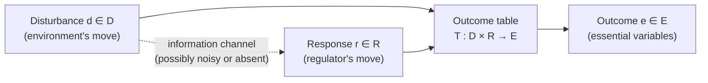
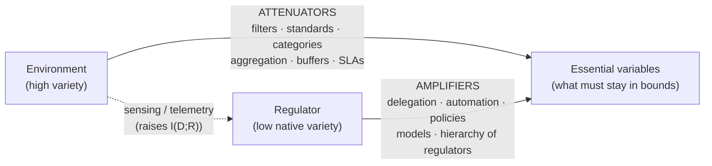

# Ashby's Law of Requisite Variety — the formal core

> Part of the [cybernetics-requisite-variety](../README.md) series. Previous: foundations and vocabulary. Next: variety engineering and Beer's management cybernetics.

W. Ross Ashby's Law of Requisite Variety is the closest thing cybernetics has to a conservation law. Informally: **a regulator can hold outcomes steady only to the extent that its repertoire of responses can match the repertoire of disturbances it faces.** Ashby compressed it into five words:

> "Only variety can destroy variety." — W. Ross Ashby, *An Introduction to Cybernetics* (1956)

This document gives the formal core: what variety is, the game-theoretic setup Ashby used, the combinatorial bound with fully worked arithmetic, the entropy generalization, the deep connection to Shannon's channel-capacity results and error-correcting codes, the companion "good regulator" theorem, and — importantly — what the law does *not* say.

---

## 1. Variety: counting distinguishable states

**Definition.** The *variety* of a set is the number of elements in it that are distinguishable *by a given observer, for a given purpose*. If a set X has states {x₁, …, xₙ} that we can and care to tell apart, its variety is

```
V(X) = |X| = n
```

It is usually more convenient to work with the logarithm:

```
v(X) = log₂ |X|    (measured in bits)
```

The log form turns multiplication into addition: a system made of two independent parts with 8 and 4 distinguishable states each has 8 × 4 = 32 joint states, i.e. 3 + 2 = 5 bits of variety. Logarithmic variety is exactly the entropy of a uniform distribution over the states, which is why the counting version of the law upgrades so cleanly to an information-theoretic version (Section 4).

Two features of this definition matter enormously and are often skipped:

1. **Variety is relative to a set of distinctions.** A traffic light has variety 3 to a driver (red / amber / green), variety 2 to a colorblind pedestrian who only distinguishes "top lamp lit" from "not," and enormous variety to a photometer logging lamp voltages. There is no observer-free state count. Ashby is explicit about this: variety is defined only once you have fixed which differences count as differences.
2. **Variety is relative to a timescale and a purpose.** The "states of a warehouse" for a fire-safety regulator (a handful of temperature/smoke conditions) and for an inventory system (millions of stock configurations) are different partitions of the same physical object.

Keep both points in hand; they defuse most abuses of the law (Section 7).

---

## 2. The regulation game: D, R, E, and the table T

Ashby modeled regulation as a two-player table game (*An Introduction to Cybernetics*, Part III).

- **D** — a finite set of *disturbances*. The environment picks one. Think: which fault occurs, which order arrives, which attack is attempted.
- **R** — a finite set of *responses* (moves) available to the regulator.
- **T** — a fixed *outcome table*, a function `T : D × R → E`. The world's physics: given what happened and what the regulator did, this is what results.
- **E** — the set of *outcomes* (in Ashby's terms, the states of the "essential variables" — the quantities that must stay within survivable/acceptable limits).

Play: the environment selects `d ∈ D`; the regulator, possibly after observing something about `d`, selects `r ∈ R`; the outcome is `T(d, r)`. The regulator wins to the degree that outcomes land in a small target subset of E — ideally a single "all is well" outcome, whatever the disturbance.



**The structural condition that gives the law its teeth.** Assume that for each fixed response `r`, the map `d ↦ T(d, r)` is *injective*: within any single column of the table, no outcome repeats. This encodes the assumption that differences in the disturbance genuinely propagate to differences in outcome unless the regulator *actively counters them with a different response*. If some single response flattened all disturbances into one outcome (a constant column), regulation would be free and no law could bind — but such magic responses are rare in practice, and where one exists (e.g. "switch the machine off") it usually violates the goal by other means.

A *regulation policy* is a function `ρ : D → R` — for each disturbance, which response the regulator ends up making. (A policy presumes the regulator can discriminate the disturbances; Section 4 returns to what happens when it can't.) The achieved outcome set is

```
E_ρ = { T(d, ρ(d)) : d ∈ D }
```

and the regulator wants |E_ρ| as small as possible.

---

## 3. The combinatorial statement, with worked arithmetic

**Theorem (requisite variety, counting form).** Under the column-injectivity condition, every policy ρ satisfies

```
|E_ρ| ≥ ⌈ |D| / |R| ⌉
```

equivalently, in logs:

```
v(E) ≥ v(D) − v(R)
```

Outcome variety can be forced down below disturbance variety only by spending response variety, one log-unit against one log-unit.

**Proof sketch (pigeonhole).** The policy ρ partitions D into at most |R| groups, one per response actually used. Some group contains at least |D|/|R| disturbances. All disturbances in that group receive the *same* response r, and within column r the outcomes are distinct by injectivity — so that group alone already produces at least ⌈|D|/|R|⌉ distinct outcomes. ∎

Note what the proof does *not* need: it holds whether or not the regulator sees the disturbance perfectly, because it holds for the realized policy whatever process produced it. Information limits make things *worse* than this bound, never better.

### A worked 3 × 3 example

Let D = {d₁, d₂, d₃}, R = {r₁, r₂, r₃}, E ⊆ {a, b, c}, with this table (rows: disturbances; columns: responses):

|        | r₁ | r₂ | r₃ |
|--------|----|----|----|
| **d₁** | a  | b  | c  |
| **d₂** | b  | c  | a  |
| **d₃** | c  | a  | b  |

Every column contains a, b, c once each (a Latin square), so column-injectivity holds.

**Full repertoire, |R| = 3.** The bound says |E_ρ| ≥ ⌈3/3⌉ = 1, and 1 is achievable. Suppose the target outcome is `a`. Read each *row* for where `a` sits:

- d₁ → play r₁ → outcome a
- d₂ → play r₃ → outcome a
- d₃ → play r₂ → outcome a

Achieved outcome set: {a}. Perfect regulation: |E_ρ| = 1 = 3/3. ✔

**Restricted repertoire, |R| = 2.** Now forbid r₃; the regulator may only use {r₁, r₂}. Bound: |E_ρ| ≥ ⌈3/2⌉ = 2. Check that 1 is genuinely impossible by listing each disturbance's reachable outcomes:

- d₁ can reach {a, b}
- d₂ can reach {b, c}
- d₃ can reach {c, a}

No single letter appears in all three reachable sets (a misses d₂, b misses d₃, c misses d₁), so no policy pins the outcome to one value. But 2 is achievable, e.g. keep outcomes in {a, b}: d₁ → r₁ (a), d₂ → r₁ (b), d₃ → r₂ (a). So the best possible is exactly ⌈3/2⌉ = 2. ✔

**Degenerate repertoire, |R| = 1.** Only r₁ available: outcomes are a, b, c — all of them. |E_ρ| = 3 = 3/1. With no response variety, outcome variety equals disturbance variety; the disturbances pass straight through. ✔

In bits: v(D) = log₂ 3 ≈ 1.585. With two responses, v(R) = 1 bit, so v(E) ≥ 0.585 bits, i.e. |E| ≥ 2^0.585 ≈ 1.5 — and since outcome counts are integers, at least 2. The arithmetic in logs and in counts agrees, as it must.

A larger sanity check: |D| = 8 disturbances, |R| = 4 responses ⇒ best achievable |E| is 8/4 = 2 outcomes (3 bits − 2 bits = 1 bit of irreducible outcome variety). To get |E| = 1 you need |R| ≥ 8. The law is exactly this brutal division, everywhere, always — given its premises.

---

## 4. The entropy form: H(E) ≥ H(D) − H(R) − H(K)

Counting states treats all disturbances as equally likely and perfectly distinguishable. The probabilistic version replaces counts with Shannon entropies and is both sharper and more honest about information limits.

Let D, R, E now be random variables with E = T(D, R), the table still column-injective. Then:

```
H(E) ≥ H(E | R)              (conditioning never increases entropy)
     = H(D | R)              (given R = r, the map d ↦ T(d,r) is injective, so E and D determine each other)
     = H(D) − I(D ; R)       (definition of mutual information)
     = H(D) − H(R) + H(R | D)
     ≥ H(D) − H(R)
```

(The first line is the standard fact H(E) ≥ H(E|R); the rest is bookkeeping.) So the core probabilistic law is:

```
H(E) ≥ H(D) − H(R),     and more sharply     H(E) ≥ H(D) − I(D ; R)
```

**Reading each term:**

- **H(D)** — the uncertainty of the disturbance load, *as it arrives at the point of regulation*. Not "the complexity of the world"; the entropy of what actually reaches you, on your chosen partition and timescale.
- **H(R)** — the entropy of the regulator's responses: its usable decision capacity in bits per move. A regulator that in practice always does the same thing has H(R) ≈ 0 no matter how large its nominal menu.
- **H(E)** — the residual uncertainty in the essential variables. Regulation succeeds as H(E) is driven toward its floor. The floor is not zero by right; it is whatever the inequality leaves over.
- **I(D ; R)** — the sharpening. Only response variety that is *correlated with the disturbance* reduces outcome entropy. A regulator that thrashes randomly can have huge H(R) and help not at all: if R is independent of D, then I(D;R) = 0 and H(E) ≥ H(D). Variety must be *steered by information about the disturbance* to count. This is why sensing, telemetry, and diagnosis are not overhead on regulation — they are regulation.

**The H(K) term.** Expository treatments (e.g. Heylighen and Joslyn's survey) often write the law with a third subtracted term:

```
H(E) ≥ H(D) − H(R) − H(K)
```

where **H(K)** accounts for *passive buffering*: variety absorbed by the fabric of the system itself rather than by any active choice — thermal mass, insulation, inventory, crumple zones, error margins, redundancy of material. A well-lagged boiler shrugs off ambient temperature swings that would otherwise demand active response; the lagging "destroys variety" without deciding anything.

Be honest about the status of this term: in the strict formalism, buffering is not separate from the table — a buffer just changes T so that many disturbances map to the same outcome under the null response (deliberately breaking column-injectivity for the disturbances it absorbs). Splitting H(K) out is an *accounting convention*, useful because in design practice "make the plant insensitive" and "make the controller smarter" are different budget lines. It is not an independent theorem, and different authors define K differently. Use the three-term form as a designer's ledger:

> Disturbance variety in ≥ variety absorbed passively (K) + variety countered actively (R, informed by I(D;R)) + variety that shows up in outcomes (E).

Something must absorb the variety; the only choice is what.

---

## 5. Shannon's Theorem 10 and error-correcting codes

Ashby himself insisted the law was not a rival to information theory but a sibling of it — essentially a re-expression, in regulatory terms, of Shannon's Theorem 10 in *A Mathematical Theory of Communication* (1948). Shannon's result: if a noisy channel leaves an equivocation (residual uncertainty) of H_y(x) about the transmitted message, then a supplementary *correction channel* can drive the error rate as low as desired **if and only if** its capacity is at least H_y(x). Correction capacity below the equivocation leaves an irreducible residue of error.

The dictionary between the two results:

| Shannon (communication) | Ashby (regulation) |
|---|---|
| Noise corrupting the message | Disturbances D perturbing the essential variables |
| Correction channel | Regulator R |
| Correction-channel capacity | Response variety H(R), usable only via I(D;R) |
| Residual equivocation / errors | Residual outcome entropy H(E) |

In both, an unwanted flow of entropy can only be cancelled by an equal-or-greater flow of compensating information. Regulation *is* error correction, aimed at the state of a plant instead of the content of a message.

**Error-correcting codes make the bound concrete.** Take a binary code with block length n and k data bits, so n − k check bits. The decoder observes the *syndrome* — a string of n − k bits — and must decide which error pattern occurred. There are 2^(n−k) distinguishable syndromes. To correct every pattern of up to t bit-flips, the syndromes must discriminate all of them:

```
Σ_{i=0}^{t} C(n, i)  ≤  2^(n−k)      (the Hamming / sphere-packing bound)
```

Read cybernetically: the left side is the *variety of disturbances* (correctable error patterns, including the no-error pattern), the right side is the *variety of the regulator's discriminations* (syndromes). The Hamming bound is the Law of Requisite Variety wearing a coding-theory uniform. Worked instance: the Hamming(7,4) code has 2³ = 8 syndromes and must distinguish 1 + C(7,1) = 8 patterns (no error, or one of 7 single-bit flips). Eight against eight — the bound met with equality, a "perfect code," i.e. a regulator with exactly requisite variety and none to spare. It corrects every single-bit error and is helpless against double errors, precisely as the law predicts.

---

## 6. The companion result: the good regulator theorem

Requisite variety bounds *how much* regulatory capacity is needed. A companion theorem constrains *what form* a maximally effective regulator must take. Conant and Ashby (1970) proved, for a deterministic setup and an optimality criterion of minimizing outcome entropy without unnecessary complexity, the result announced in their title:

> "Every good regulator of a system must be a model of that system." — Conant & Ashby (1970)

Formally: among regulators achieving the best possible (error-free, in their setup) regulation, the simplest ones act as a deterministic mapping of the regulated system's states — a homomorphic image, i.e. a model. Intuition: if the regulator's actions did *not* systematically track the system's states, the slack between them would either add outcome entropy (not optimal) or be dead weight (not simplest).

Caveats, because this theorem is quoted far beyond its warranty:

- "Model" is a precise, weak notion (a mapping consistent with the system's behavior), not a claim that good controllers contain detailed internal simulations.
- The hypotheses are strong: deterministic mappings, attainable error-free regulation, and a specific minimality criterion. Real controllers live in noise and trade-offs.
- A rigorous cousin exists in control theory — the internal model principle of Francis and Wonham (1976): a linear controller achieving robust rejection of a class of disturbances must embed a generator (model) of those disturbances. The convergence of the two lines of work, from very different formalisms, is genuine evidence that "regulation requires modeling" is more than a slogan — but each theorem should be cited with its own hypotheses attached.

---

## 7. Common misreadings

The law is abused at least as often as it is used. The recurring failure modes:

1. **It is a bound, not a recipe.** Requisite variety is *necessary*, never sufficient. A firm can have ample response variety and still fail through bad mappings (wrong response paired to disturbance), latency (right response, too late — the table quietly assumes the response lands in time), or ignorance (variety uncorrelated with D, so I(D;R) ≈ 0). Meeting the bound buys you the *possibility* of regulation, nothing more.
2. **Variety is context-relative, so cross-context counts are meaningless.** "The market has more states than the manager's brain" is rhetoric, not measurement, until both varieties are counted against the *same* outcome distinctions on the *same* timescale. The manager does not need to match the market's microstates — only the variety that survives attenuation and is *relevant to the essential variables*. Forgetting this makes the law prove far too much (it would forbid all regulation of anything by anything smaller).
3. **Measurement is genuinely hard.** Real disturbance spaces are open-ended; distributions are non-stationary; H(D) is rarely computable. In engineering contexts (codes, control loops) the law yields real numbers; in organizational contexts it functions as an accounting discipline — a checklist question ("where does this variety get absorbed?") rather than a computable inequality. Both uses are legitimate; pretending the second is the first is not.
4. **"Tautology" — true, and beside the point.** Given its premises the law is mathematics, so it cannot be falsified by experiment, and critics occasionally file it under "unfalsifiable, therefore empty." The same objection applies to conservation of energy as an accounting identity. The empirical content lies in the *mapping*: whether your situation really has a fixed table, separable D and R, effective column-injectivity, responses that land in time. When the mapping holds, the law bites; when it doesn't, invoking the law is decoration.
5. **"More variety is always better" — no.** The law says *match*, not *maximize*. Unsteered response variety does nothing (Section 4), costs money, and adds its own failure modes. The cheapest way to satisfy the inequality is usually to shrink the left side, not grow the right — which is the next section.

---

## 8. Closing the gap: attenuators and amplifiers

Suppose the books don't balance: disturbance variety reaching the essential variables exceeds what the regulator can counter. Exactly two families of moves exist, and every real design mixes them.



**Attenuators shrink H(D) — the variety that ever reaches the point of regulation.**

- Standardization: three product tiers instead of bespoke everything turns a continuum of demands into a small menu.
- Categorization and triage: an incident severity scheme maps thousands of distinct failures onto four response classes.
- Aggregation: managing a distribution (mean latency, defect rate) instead of every individual event.
- Buffers and insulation: the H(K) ledger line — inventory, thermal mass, rate limits, error margins.
- Interface contracts and SLAs: refusing to accept disturbances outside a declared envelope.

**Amplifiers grow effective H(R) — responses deployed per unit of scarce decision-making.**

- Delegation and hierarchy: one policy decision configures many local regulators, each handling local variety. (Ashby analyzed this as *amplifying regulation*: a small regulator can supervise the construction or selection of a larger one — regulation compounds through stages.)
- Automation: a control rule written once responds correctly to states its author will never individually see.
- Models and forecasts: per the good regulator theorem, a model lets one decision cover a whole class of situations.
- Training and doctrine: install response repertoires in people so central capacity isn't consumed per event.

One caution keeps the bookkeeping honest: a deterministic mechanism cannot *create* variety — the output variety of a fixed transducer is at most its input variety. "Amplifiers" never conjure variety from nothing; they *recruit and align variety that already exists elsewhere* (in subordinates, machines, market participants, physics) so that it serves the regulatory goal instead of fighting it. That reframing — regulation as the design of variety flows across a boundary, attenuating inward and amplifying outward until the inequality balances — is exactly the program Stafford Beer industrialized as *variety engineering*, the subject of the next document.

---

## Sources

- W. Ross Ashby, *Design for a Brain*, 1952 (2nd ed. 1960).
- W. Ross Ashby, *An Introduction to Cybernetics*, 1956. (The regulation game, the counting law, and amplifying regulation are developed in Part III.)
- W. Ross Ashby, "Requisite Variety and Its Implications for the Control of Complex Systems," *Cybernetica* 1(2), 1958.
- Claude E. Shannon, "A Mathematical Theory of Communication," *Bell System Technical Journal* 27, 1948. (Theorem 10, the correction-channel result.)
- Richard W. Hamming, "Error Detecting and Error Correcting Codes," *Bell System Technical Journal* 29, 1950.
- Roger C. Conant, "The Information Transfer Required in Regulatory Processes," *IEEE Transactions on Systems Science and Cybernetics* SSC-5(4), 1969.
- Roger C. Conant and W. Ross Ashby, "Every Good Regulator of a System Must Be a Model of That System," *International Journal of Systems Science* 1(2), 1970.
- Bruce A. Francis and W. Murray Wonham, "The Internal Model Principle of Control Theory," *Automatica* 12(5), 1976.
- Stafford Beer, *Brain of the Firm*, 1972 (2nd ed. 1981).
- Stafford Beer, *The Heart of Enterprise*, 1979.
- Francis Heylighen and Cliff Joslyn, "Cybernetics and Second-Order Cybernetics," in R. A. Meyers (ed.), *Encyclopedia of Physical Science & Technology*, 3rd ed., 2001. (Survey source for the three-term H(K) bookkeeping form.)
