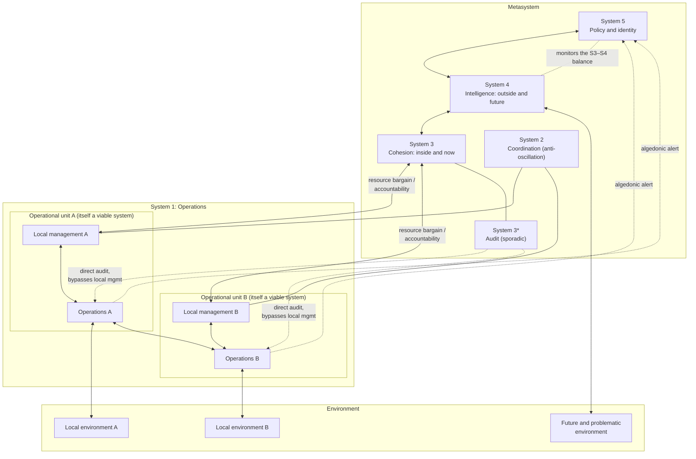

# The Viable System Model

Stafford Beer spent most of his career on one question: what must be true of the *organization* of a system — any system — for it to keep existing in an environment that never stops changing? His answer, developed across three books (*Brain of the Firm*, *The Heart of Enterprise*, and *Diagnosing the System for Organizations*), is the **Viable System Model (VSM)**: a claim that every system capable of sustaining an independent existence necessarily performs five distinct functions, connected by specific communication channels, and that the whole pattern repeats at every level of organization.

This document explains what viability means, walks through the five systems, develops the variety arithmetic that justifies them, describes the recursive structure and the algedonic channel, gives an honest account of Project Cybersyn, and closes with the standard criticisms and the standard replies.

> Prerequisite: the Law of Requisite Variety and the vocabulary of variety, attenuation, and amplification (covered earlier in this repo). The VSM is best understood as *applied* requisite variety — a structural answer to the question "where does all that regulatory variety come from?"

---

## 1. What "viable" means

In Beer's usage, a system is **viable** if it is capable of maintaining a separate existence — of surviving — in its particular environment, over a time horizon long enough that the environment will change in ways nobody predicted at design time.

Several things are packed into that definition:

- **Identity maintenance, not state maintenance.** A viable system does not preserve any particular configuration of itself. Firms replace every employee, product, and building and remain "the same firm." Viability is about preserving a coherent identity and the capacity to act, while the substrate churns.
- **Adaptation is included.** Because the environment changes unpredictably, mere robustness (tolerating disturbances within an envelope) is not enough. A viable system must be able to *change what it does* — and in the limit, change what it *is* — without falling apart. This is the lineage of Ashby's **ultrastability**: a system that, when its essential variables are pushed out of bounds, changes its own internal organization until it finds a configuration that works.
- **Viability is relative to an environment.** Nothing is viable in the abstract. A firm viable in one regulatory regime, market, or ecosystem may be non-viable in another.
- **Viability is not success.** A barely-surviving firm and a thriving one are both viable. The VSM claims to specify *necessary* conditions for survival, not sufficient conditions for excellence.

The model's central claim can then be stated:

> **Any system that remains viable in a complex, changing environment necessarily performs five functions — operations, coordination, cohesion (with audit), intelligence, and policy — and connects them with channels of adequate capacity. These functions are defined by what they do, not by who does them or what box on the org chart they occupy.**

That last clause matters. The VSM is a model of *functions and information flows*, not of departments, ranks, or reporting lines. In a three-person company all five functions exist; they are just performed by the same three heads at different moments.

---

## 2. The five systems

Beer numbered the functions System 1 through System 5. The numbering is unfortunate — it invites reading the model as a status hierarchy, which it is not. The vertical arrangement is *logical* (each layer handles variety the layer below cannot), not a chain of command in the traditional sense.

### System 1 (S1) — Operations

The operational units that do what the organization exists to do: make the product, treat the patients, teach the students, run the routes. Each S1 unit is a complete transformation embedded in its **own local environment** (its customers, suppliers, local conditions), with its own local management.

Two design principles govern S1:

1. **Each S1 unit should itself be a viable system.** This is the recursion principle (Section 4).
2. **S1 units should have maximum autonomy consistent with cohesion of the whole.** Autonomy is not a managerial kindness; it is a variety requirement. The local environment's variety is enormous, and only the local unit is positioned to absorb it. Every decision pulled up the hierarchy is variety the metasystem must now handle — and it cannot.

### System 2 (S2) — Coordination

Autonomous S1 units sharing resources and interfaces will, left alone, oscillate: two plants bidding up the same scarce input, two sales teams poaching each other's accounts, two wards double-booking the same operating theatre. S2 is the **anti-oscillatory** function: shared schedules, standards, protocols, common information formats, timetables — the mechanisms by which S1 units mutually adjust *without* escalating every conflict upward.

S2 is deliberately weak. It does not command; it damps. A production schedule, an accounting convention, or an internal wiki is S2. Its cybernetic job is to absorb the variety generated by S1-to-S1 interaction so that S3 never sees it.

### System 3 (S3) — Cohesion, and the resource bargain

S3 is responsible for the **inside-and-now**: the synergy and cohesion of the whole operational complex. Its principal instrument is what Beer called the **resource bargain**: S3 negotiates with each S1 unit — resources and freedom of action granted downward, in exchange for accountability against agreed expectations upward. Once the bargain is struck, S3 stays out of the way.

S3 also arbitrates when S2's damping is insufficient, reallocates resources when priorities shift, and ensures legal and policy constraints are actually met. It is the lowest level at which anyone thinks about the operational units *as a portfolio* rather than one at a time.

The pathology to avoid is S3 micromanagement: intervening inside S1 continuously rather than by exception. In variety terms, a micromanaging S3 is attempting to match the full variety of the operations with the tiny variety of a management team — a fight it must lose (Section 5).

### System 3\* (S3-star) — Audit

The resource bargain runs on a summarized, self-reported channel: S1 tells S3 how things are going, in aggregated form. Summaries are attenuators, and attenuators discard information — sometimes the information that matters, sometimes (when incentives are misaligned) precisely the information that matters. S3\* is the compensating channel: **sporadic, direct inspection of operations that bypasses S1's own management reporting.** Financial audits, safety inspections, quality spot checks, employee surveys, "management by walking around."

Two properties keep S3\* healthy: it is *intermittent* (a continuous S3\* is just surveillance, and its variety cost explodes), and it is *openly declared* (a covert S3\* destroys the trust the resource bargain depends on).

### System 4 (S4) — Intelligence

S3 faces inside and now. Someone must face **outside and future**: markets shifting, technologies emerging, regulation coming, the climate changing. S4 is the intelligence function — research, strategy, scanning, modeling, development. Crucially, S4 must contain a **model of the organization itself and its environment**, because adaptation means simulating "what would happen to *us* if...?" before committing. This is where the Conant–Ashby "good regulator" theorem bites: a regulator of a system can only be as good as the model of that system it embodies.

S4 and S3 are natural antagonists — one wants to invest in the future, the other to deliver in the present — and Beer insisted they must be locked in continuous, structured dialogue (a homeostat, in his language), not communicating only through a yearly planning ritual. Most large-organization failures of adaptation are, in VSM terms, a broken or ceremonial S3–S4 loop.

### System 5 (S5) — Policy and identity

When S3 and S4 cannot resolve their tension — present versus future, exploitation versus exploration — something must close the loop. S5 supplies **closure**: identity, purpose, ultimate ground rules. It answers "who are we, and what would we never do?" and it monitors the S3–S4 interaction, intervening when that homeostat runs out of balance.

S5 is not "the CEO." In VSM terms it is the function that maintains identity — which may be distributed across a board, a founding culture, a constitution, or a professional ethos. Beer's warning about S5 is that it must not collapse into S3 (a leadership that only firefights the present has left the organization with no identity function and no arbiter for the future).

A one-line summary table:

| System | Nickname | Time/space focus | Failure mode when absent or weak |
|---|---|---|---|
| S1 | Operations | Here and now (per unit) | Nothing gets done |
| S2 | Coordination | Between units, now | Oscillation, internal friction, escalation overload |
| S3 | Cohesion | Inside and now (whole) | Fragmentation; or, if overactive, micromanagement |
| S3\* | Audit | Inside, sporadic | Cooked books, quiet rot behind good reports |
| S4 | Intelligence | Outside and future | Blindsiding; the firm optimizes itself into obsolescence |
| S5 | Identity | Everywhere, always | Drift; S3–S4 deadlock; capture by the loudest subsystem |

Beer called Systems 3, 4, and 5 collectively the **metasystem**: the part of the organization whose job is not to *do* but to ensure the doing coheres, adapts, and stays itself. (System 2 and System 3\* are metasystemic *services* — the coordination and audit channels through which the metasystem manages System 1 — rather than parts of the metasystem proper.) "Meta" is logical, not social — the metasystem talks *about* the operations in a language the operations cannot use about themselves, which is different from outranking them.

---

## 3. The model in one diagram



Reading notes: the operational units couple directly to their own slices of the environment (and to each other — operations interact physically, not just through management). The metasystem couples to the operations through *several parallel channels* — the resource bargain, S2 coordination, S3\* audit, and the algedonic line — and to the environment mostly through S4. No single channel is expected to carry everything; the design distributes variety across all of them.

---

## 4. Recursion: viable systems all the way down

The VSM's most distinctive structural claim is the **recursive system theorem**: every viable system *contains* viable systems and is *contained in* a viable system. A division of a firm is a viable system whose S1 units are plants; a plant is a viable system whose S1 units are lines; the firm itself is an S1 unit within an industry or economy, which is a viable system in turn.

Consequences:

- **The full five-system pattern recurs at every level.** A plant does not merely "report to" the division; the plant has its own S2 scheduling, its own S3\* checks, its own S4 watching local technology and labor markets, its own S5 sense of what the plant is. The division's metasystem manages *residual* variety only — whatever the plants cannot absorb themselves.
- **Levels of recursion are a modeling choice.** Before diagnosing anything, you must declare the *system-in-focus* and identify one level of recursion up and down. Much confusion in VSM applications traces to mixing levels — treating, say, a corporate S4 function as if it were the S4 of a subsidiary.
- **Recursion is what makes the model scale.** No level needs a model of everything; each metasystem needs requisite variety only with respect to the residuals of the level below. This is the same trick by which hierarchical control appears throughout biology, and it is the only known general answer to regulating systems whose total variety is astronomically beyond any single regulator.

Note that recursion in the VSM is *containment of function*, not the org chart's containment of headcount. A matrix organization, a franchise network, and a federated open-source project can all be drawn as VSM recursions even though their org charts look nothing alike.

---

## 5. Variety engineering: why the structure has this shape

The VSM is not an aesthetic preference; every structural feature is an answer to a variety imbalance. The basic setup is a chain of three unequal variety pools:

```
V(environment)  >>  V(operations)  >>  V(management)
```

The environment can present vastly more distinct situations than the operations have distinct responses, and the operations generate vastly more detail than any management can attend to. Ashby's law — "only variety can destroy variety" (Ashby, *An Introduction to Cybernetics*, 1956) — says these gaps cannot be wished away; they must be engineered away. Beer's term for this is **variety engineering**, and it has exactly two instruments:

- **Attenuators** reduce the variety flowing toward the lower-variety party: aggregation, exception reporting, market segmentation, standardization, delegation itself (autonomy granted to S1 is variety the metasystem never sees).
- **Amplifiers** increase the effective variety of the lower-variety party: policies and rules (one decision covering many cases), training, branding and advertising (shaping the environment's behavior), tooling, automation.

Beer's design principle — stated formally in *The Heart of Enterprise* as his first organizational axiom, and paraphrased here — is that across each interface, **the varieties absorbed in both directions must balance**, and further, that they *will* balance whether you design them or not. An undesigned balance is still a balance; it is achieved by queues, crises, burnout, lost customers, and quiet abandonment of standards. The choice is never "balance or no balance" but "designed balance at acceptable cost, or emergent balance at whatever cost happens."

Worked micro-example — a support organization as an S3/S1 interface:

- 40 agents (S1) handle ~2,000 tickets/day drawn from an environment of effectively unbounded customer situations.
- Environment→S1 attenuation: a triage form and category menu collapse unbounded complaints into ~50 ticket types. S1→environment amplification: macros, a public knowledge base, and status pages let 40 agents "answer" hundreds of thousands of users.
- S1→S3 attenuation: the support manager sees *only* four aggregate signals (volume, backlog, resolution time, satisfaction) plus exceptions. S3→S1 amplification: a written escalation policy resolves thousands of individual judgment calls without the manager present.
- S3\* correction: the manager personally reads a random 1% sample of closed tickets weekly — because the four aggregates are attenuators, and a metric-gamed queue can look healthy while customers seethe.

Every arrow in the VSM diagram is one of these attenuator/amplifier pairs, and "diagnosis" in Beer's sense largely consists of finding the interfaces where the pair is missing, saturated, or faked. His channel-capacity principle adds the engineering detail: each channel must carry more variety per unit time than the originating subsystem generates in that time, *and* the transduction at each end (encoding into reports, decoding into decisions) must not itself destroy requisite variety. A perfect dashboard nobody can interpret fails at transduction, not transmission.

---

## 6. Algedonic signals: the pain channel

All the channels described so far are *filtered* — deliberately, because filtering is attenuation and attenuation is survival. But filters create a specific catastrophic risk: a signal that something is going badly wrong at the operational level may be averaged, summarized, and reassured out of existence on its way up. By the time the smoothed numbers alarm anyone, it is too late.

Beer's answer is the **algedonic channel** (from the Greek roots for pain and pleasure): a dedicated alarm path that **bypasses every filter and every intermediate level** and delivers a raw signal of distress directly to System 5. Its properties:

- It carries almost no variety — essentially one bit ("this is beyond the regular structure; wake up") — which is exactly why it can afford to skip the filters.
- It is triggered by *physiological* criteria, not managerial judgment: an essential variable out of bounds, full stop.
- It must be rare. An algedonic channel that fires constantly is either measuring the wrong variables or reporting a broken regular structure; either way it degrades into noise and the organization learns to ignore it — the worst possible outcome.

Real instances: the andon cord in Toyota-style production (any worker halts the line, and the halt is instantly visible to senior management); aviation and medical mandatory-incident reporting; whistleblower channels that reach the board directly rather than through the accused chain of management. In each case the design logic is identical: normal channels optimize for attenuation; the algedonic channel exists because attenuation must never be total.

---

## 7. Project Cybersyn (Chile, 1971–1973)

The VSM's most famous application was also its most audacious: an attempt to apply the model to an entire national economy in real time.

### What it was

In 1971, Fernando Flores — then a young executive in CORFO, the Chilean state development agency responsible for the newly nationalized industrial sector under Salvador Allende's government — invited Beer to Chile. Beer arrived in November 1971, and over roughly two years a small Chilean–British team built the components of **Project Cybersyn** (in Spanish, *Synco*):

- **Cybernet** — a national communications network built largely from *telex machines*, several hundred of them, many requisitioned from existing stock, linking state-sector enterprises to a control center in Santiago. In a country with scarce computing and telephone infrastructure, telex was the pragmatic variety channel available.
- **Cyberstride** — statistical filtering software running on a government mainframe in Santiago. Factories transmitted a small set of daily production indices; Cyberstride applied short-term Bayesian forecasting methods (adapted from then-recent work by Harrison and Stevens) to detect *significant* changes and trends, alerting managers by exception rather than drowning them in data. This is textbook variety attenuation: raw factory life compressed into a handful of indices, then filtered again so only meaningful deviations propagated upward.
- **Beer's index scheme** — each operation reported *actuality* (what it did), against *capability* (what it could do now with existing resources) and *potentiality* (what it could do if known improvements were made), yielding normalized performance and latency indices comparable across wildly different industries.
- **CHECO** — an experimental simulator of the Chilean economy, intended as the S4 modeling capability. It never progressed far beyond prototypes.
- **The Opsroom** — a hexagonal operations room with futurist swivel chairs, wall screens for the index displays, and controls built into armrests: the intended physical S3–S4–S5 interface. A working prototype was completed in Santiago; it was designed (by a team including designer Gui Bonsiepe) to be readable by workers and ministers alike, deliberately avoiding keyboard-and-typist culture.
- **Project Cyberfolk** — Beer's most experimental strand: simple "algedonic meters" by which the public could continuously signal aggregate satisfaction or distress with, for example, televised government proposals — an attempt to give the *polity* an algedonic channel. It was tried only in small experiments.

The system had one genuine operational moment of fame. During the October 1972 *gremio* strike, when a nationwide truck owners' stoppage threatened to paralyze the country, the government used the Cybernet telex network as a real-time logistics coordination tool — tracking which roads were open, what supplies were where, which of the remaining trucks to dispatch. Participants credited the network with a real role in the government's survival of the strike, and the episode dramatically raised the project's status inside the government.

The project ended on 11 September 1973 with the military coup in which Allende died. The incoming regime had no use for the system; the Opsroom prototype was subsequently dismantled/destroyed, and several project participants went into exile or, like Flores, into imprisonment before exile.

### What it wasn't

Cybersyn has since become a screen onto which people project both utopias and dystopias, so honesty requires deflating several myths in both directions:

- **It was not real-time control of the economy.** Data arrived daily at best, often later; coverage of the nationalized sector was partial; the "real-time economy" was an aspiration, not an achievement. On any given day, much of the apparatus was prototype, demo, or paper.
- **It was not a supercomputer network.** It was a few hundred telexes feeding one shared mainframe. Its sophistication was conceptual (the index scheme, exception filtering, the VSM framing), not computational.
- **It was never completed.** CHECO barely functioned; the Opsroom was never used for routine national management; the full recursive rollout across the economy existed mostly in design documents.
- **It was not, in design intent, a surveillance apparatus** — Beer's papers insist on worker participation in building the models, on autonomy at every recursion, and on the algedonic channel as protection *against* central blindness. But intent is not implementation: the historian Eden Medina, whose *Cybernetic Revolutionaries* (2011) is the definitive archival study, documents the gap — engineers under deadline built the data flows top-down, worker participation in modeling was thin, and the same channels designed for factory-upward signaling could, under a different government, have served monitoring-downward purposes. The British press at the time attacked the project as computerized authoritarianism; Beer spent years replying that a system built to *maximize* S1 autonomy was the opposite. Both the criticism and the reply deserve to be on the record.
- **It proves less than partisans claim.** Two years, one crisis creditably handled, and a coup: the record can support neither "cybernetic socialism works" nor "it was always doomed." What Cybersyn genuinely demonstrates is narrower and still interesting: that VSM-style variety engineering could be *articulated as a concrete national-scale design* with 1971 technology, and that the political environment, not the engineering, was the binding constraint on ever finding out more.

---

## 8. Criticisms and responses

The VSM has attracted serious criticism for fifty years. The main lines, with the standard responses, and an honest assessment of where each exchange stands:

### 8.1 Vagueness and the metaphor problem

**Criticism.** The model was derived by analogy with the human brain and nervous system (*Brain of the Firm* maps S1–S5 onto spinal, autonomic, and cortical functions). Organizations are not organisms; the analogy smuggles in assumptions (a single identity, unified purpose, cooperative parts) that organizations often violate. And in practice, deciding whether a given committee "is" S2 or S3, or where one recursion ends and another begins, involves so much interpretive freedom that two competent analysts can produce different diagrams of the same firm.

**Response.** Beer's own later position was that the neurophysiology was scaffolding, not foundation: *The Heart of Enterprise* re-derives the entire model from variety arithmetic alone, with no appeal to brains. The interpretive freedom is real but is a property of all modeling languages; the VSM's defenders (notably Espejo and the contributors to *The Viable System Model: Interpretations and Applications*) treat the model as a *diagnostic language* whose value is the quality of conversation and the pathologies it reveals — missing S4, S3 micromanagement, absent audit, blocked algedonics — rather than the uniqueness of the diagram.

**Honest assessment.** The re-derivation from variety answers the metaphor objection fairly well. The reproducibility objection is only partially answered: "useful diagnostic language" is a defensible but weaker claim than the necessity language of the theorems, and the literature contains few rigorous inter-analyst reliability studies.

### 8.2 Falsifiability

**Criticism.** The theory asserts that every viable system performs the five functions. But the functions are defined loosely enough that a motivated analyst can always find *something* to label S2 or S4 in any surviving organization — making the claim unfalsifiable in Popper's sense. Where is the organization that survived without an S4, refuting the model, or that could even in principle be observed to do so?

**Response.** Defenders make three moves. First, the necessity claim is presented as *derived* from the Law of Requisite Variety plus assumptions about environmental variety — so it has the status of an engineering theorem (like "a feedback controller needs a sensor"), which one tests by checking derivation and assumptions, not by survey. Second, the model does yield contingent, risky predictions at the level of *pathology*: it predicts specific failure modes for specific structural deficits (e.g., an organization whose S3–S4 loop is ceremonial will systematically fail at environmental transitions it had the information to see), and these are in principle checkable against organizational histories. Third, degenerate cases are acknowledged: in a sufficiently benign environment, a system can survive with atrophied functions — viability requirements scale with environmental variety.

**Honest assessment.** This is the weakest flank. The pathology predictions are checkable in principle but have mostly been examined through case studies and consultancy reports, which select on the dependent variable. Treating the VSM as strong engineering heuristics with a formal core, rather than as a tested empirical theory of organizations, is the intellectually safe position — and closer to how careful practitioners actually use it.

### 8.3 Technocracy, power, and politics

**Criticism.** Two related charges. *Technocracy:* the model optimizes viability but is silent on whose purposes the viable system serves; a concentration camp can be run viably. Werner Ulrich's critique of the Chilean experience ("A Critique of Pure Cybernetic Reason," 1981) pressed exactly this: cybernetic design answers *how* to remain viable, never *whether the purposes are legitimate*, and so risks lending efficient machinery to whatever power installs it. *Power-blindness:* real organizations run on coalitions, negotiation, and conflict; the VSM's clean functional diagrams treat politics as noise rather than as the actual mechanism, and its data channels can serve managerial surveillance regardless of design intent.

**Response.** Beer's defenders note that the model has more normative content than the critique allows: maximal S1 autonomy is a *theorem* of the model, not an option; S3\* is required to be sporadic and declared; the algedonic channel institutionalizes bottom-up override; and Beer's own writing (*Platform for Change*, *Designing Freedom*) is explicitly an argument that variety engineering should *protect* individual freedom against bureaucratic variety-crushing. Beer's aphorism — "the purpose of a system is what it does" — was itself a tool for piercing official purposes and judging systems by outcomes. On power: proponents concede the model does not theorize politics and recommend pairing it with interpretive and critical approaches; Jackson's system-of-systems-methodologies work explicitly slots the VSM into contexts where participants' goals are broadly aligned, and other methods where they are not.

**Honest assessment.** The concession is the right one. The VSM constrains *how* domination can be architected (a version with no S1 autonomy and continuous covert audit is, by the model's own lights, pathological), but it cannot prevent selective implementation — Cybersyn's own participation shortfall is the standing example. Anyone deploying VSM-style instrumentation inherits the obligation to build the protective features, not just the data flows, and the model will not enforce that obligation for them.

### 8.4 Practicality and obscurity

**Criticism.** The books are idiosyncratic, the terminology forbidding, and the method demands a systemic literacy most organizations lack; consequently uptake has been thin compared with conventional management frameworks, and many attempted applications reduce to relabeling the org chart with S-numbers.

**Response.** Largely accepted, with mitigation: later expositors (Espejo, Hoverstadt, and others) have produced substantially more accessible treatments, and the relabeling failure is a misuse the original texts explicitly warn against — the model maps functions and *channels*, and an application that never examines channel capacities has not applied it.

---

## 9. Summary

- **Viability** = the capacity to maintain identity and keep functioning in an environment that changes unforeseeably; it presupposes adaptation, not just robustness.
- The VSM claims every viable system performs **five functions**: operations (S1), coordination (S2), cohesion with audit (S3/S3\*), intelligence (S4), and policy/identity (S5) — defined functionally, not organizationally.
- **Recursion**: the whole pattern repeats at every level; each metasystem handles only the variety its operational units cannot absorb, which is the only way regulation can scale.
- The structure is forced by **variety balance**: environment ≫ operations ≫ management, bridged by designed attenuators and amplifiers on every channel — and the balance will happen anyway, brutally, if not designed.
- **Algedonic signals** are the unfiltered pain channel that keeps life-critical news from being averaged into invisibility.
- **Cybersyn** was a real, partial, technologically modest, conceptually radical implementation attempt, ended by a coup — evidence of the model's articulability at national scale, not proof of its success or failure.
- The serious criticisms — interpretive looseness, weak falsifiability, silence on purpose and power — are partially answered, and the defensible position is to treat the VSM as a **rigorously motivated diagnostic language** rather than a confirmed empirical law.

---

## Sources

- W. Ross Ashby, *Design for a Brain*, 1952.
- W. Ross Ashby, *An Introduction to Cybernetics*, 1956.
- Roger C. Conant and W. Ross Ashby, "Every Good Regulator of a System Must Be a Model of That System," *International Journal of Systems Science*, 1970.
- Stafford Beer, *Brain of the Firm*, 1972 (2nd edition 1981, which adds the Chilean chapters).
- Stafford Beer, *Platform for Change*, 1975.
- Stafford Beer, *Designing Freedom*, 1974 (the CBC Massey Lectures).
- Stafford Beer, *The Heart of Enterprise*, 1979.
- Stafford Beer, *Diagnosing the System for Organizations*, 1985.
- P. J. Harrison and C. F. Stevens, "A Bayesian Approach to Short-Term Forecasting," *Operational Research Quarterly*, 1971.
- Raúl Espejo and Roger Harnden (eds.), *The Viable System Model: Interpretations and Applications of Stafford Beer's VSM*, 1989.
- Raúl Espejo and Alfonso Reyes, *Organizational Systems: Managing Complexity with the Viable System Model*, 2011.
- Werner Ulrich, "A Critique of Pure Cybernetic Reason: The Chilean Experience with Cybernetics," *Journal of Applied Systems Analysis*, 1981.
- Michael C. Jackson, *Systems Thinking: Creative Holism for Managers*, 2003.
- Patrick Hoverstadt, *The Fractal Organization: Creating Sustainable Organizations with the Viable System Model*, 2008.
- Eden Medina, *Cybernetic Revolutionaries: Technology and Politics in Allende's Chile*, 2011.
