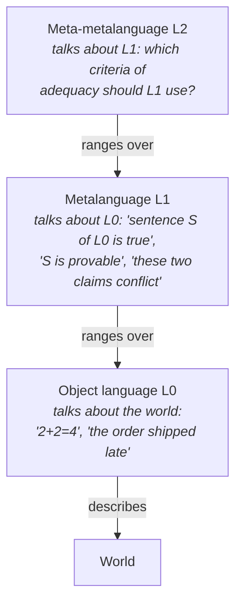
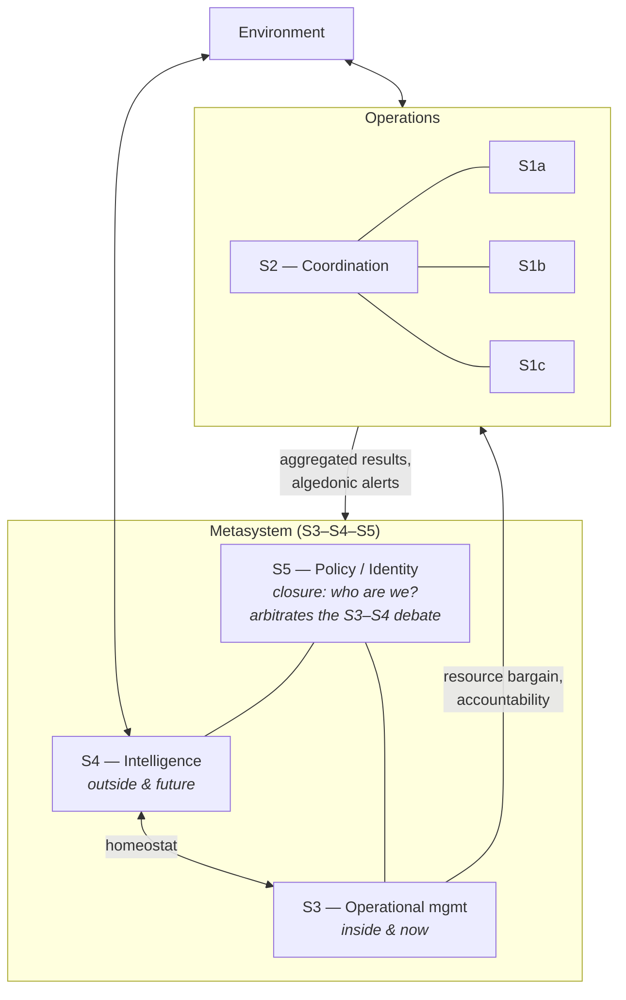
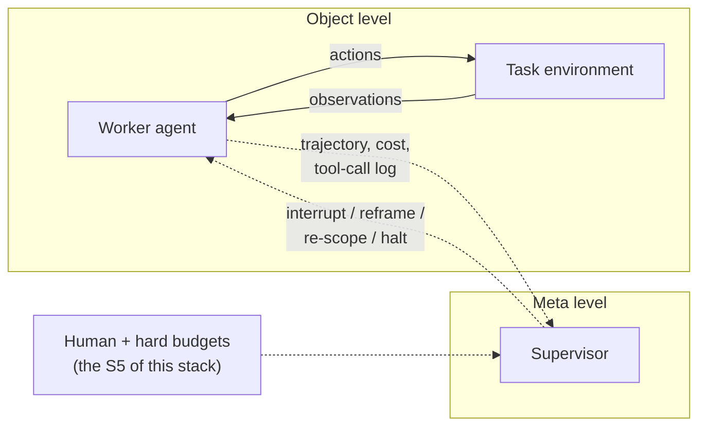

# Metalanguage and Metasystems

> Part 4 of a series on requisite variety and management cybernetics.
> Previous: variety, regulation, and the Law of Requisite Variety.
> This part: what it means for one system to be *logically above* another,
> and why Stafford Beer built the Viable System Model around that idea.

---

## 1. Why levels of language matter

Some disagreements are about facts, and evidence settles them. Some are about
moves within a shared game, and the rules settle them. But some disagreements
cannot be settled by anything available *inside* the conversation in which they
arise, because the conversation's own vocabulary is the problem. Two divisions
of a company can each be provably correct by their own metrics and still be in
irreconcilable conflict; no amount of additional data expressed in those same
metrics will resolve it.

Cybernetics inherited a precise way of talking about this situation from
mathematical logic: the distinction between an **object language** and a
**metalanguage**. Stafford Beer took that distinction — deliberately, and with
acknowledged looseness — and made it the load-bearing wall of his theory of
organization. This document explains the logical background, Beer's use of it,
how it connects to Ashby's Law of Requisite Variety, and where the analogy
frays.

---

## 2. Object language and metalanguage: the logical background

In logic, an *object language* is the language under study — the one in which
you state arithmetic claims like `2 + 2 = 4`. A *metalanguage* is the language
in which you talk *about* the object language: about its sentences, its proofs,
its truth. Two celebrated twentieth-century results show that this distinction
is not bookkeeping but necessity. Alfred Tarski proved that, for any
sufficiently expressive formal language, a truth predicate for that language
("sentence S is true") cannot be consistently defined within the language
itself — on pain of the liar paradox ("this sentence is false") — and must
instead live in an essentially richer metalanguage. Kurt Gödel proved that any
consistent formal system strong enough to express basic arithmetic contains
sentences it can neither prove nor refute; such a sentence can be settled, but
only by moving to a stronger system — which then has undecidable sentences of
its own. The shared moral: certain questions *about* a system are structurally
unanswerable *inside* it, and answering them requires a standpoint of higher
logical type. (Russell and Whitehead's theory of types, built to block the
set-theoretic paradoxes, is the same instinct applied to sets rather than
sentences.)

Note the built-in threat of regress: every metalanguage is an object language
for the level above it. Logic tolerates the infinite tower. Organizations, as
we will see, cannot — and Beer's answer to the regress is one of the more
interesting parts of the Viable System Model (VSM).

---

## 3. Beer's move: undecidability as an organizational phenomenon

Beer's claim, developed mainly in *Brain of the Firm* (1972) and *The Heart of
Enterprise* (1979), is that organizations routinely generate problems that are
*undecidable at the level at which they appear* — not because people are
stupid or data is missing, but because the language in which the level
operates lacks the variables needed to state, let alone settle, the question.

Consider the canonical case. Two production divisions share a scarce resource
— capital, a machine shop, engineering time. Each division's local language
contains variables like *my throughput*, *my unit cost*, *my delivery
performance*. Within that language, each division's claim on the resource is
sound. The conflict between the claims is not expressible in either division's
language, because neither language contains variables such as *corporate
cash position*, *long-run product mix*, or *what kind of company we intend to
be*. The question "which division gets the resource?" is, in Beer's borrowed
vocabulary, undecidable at the divisional level. It is decidable — often
easily — one level up, in a richer language whose variables range over the
divisions and their interactions.

Beer's general principle: **whenever a set of interacting systems generates
questions their shared language cannot settle, viability requires a
metasystem — a system whose language takes the lower systems themselves as its
objects.** The metasystem does not do the divisions' work, and does not speak
their language better than they do. It speaks a *different* language, in which
the divisions appear as terms.

This is an analogy to Gödel and Tarski, not an application of them, and Beer
said so. Organizations are not formal systems; "undecidable" here means
"cannot be resolved with the conceptual resources available at this level,"
not "provably independent of the axioms." Section 8 returns to what the
analogy does and does not license.

---

## 4. Metasystem ≠ boss

The most common misreading of the VSM is to hear "metasystem" as a polite word
for "senior management" and conclude that Beer is dressing up the org chart in
Greek. The relationship is logical, not social:

- **A boss outranks you. A metasystem out-*levels* you.** Rank is about who can
  compel whom. Logical level is about whose language contains whom as a
  variable. These can coincide, but neither implies the other.

- **A boss intervening in operational terms is not acting metasystemically.**
  A vice-president who overrides an engineer's design decision is simply
  another actor in the object language — and usually a worse-informed one,
  since the engineer holds far more local variety. Nothing meta has happened;
  variety has merely been relocated (and typically reduced).

- **A metasystemic act can come from anywhere.** A junior facilitator who says
  "you two are optimizing different objective functions — which one does this
  project actually serve?" has moved the discussion into a metalanguage. No
  authority was exercised; a logical level was changed.

- **The metasystem exists *for* the lower systems, not above them in the sense
  of superiority.** In Beer's design the operational units are where the
  organization actually does what it does; the metasystem is overhead,
  justified only insofar as it resolves what the units cannot resolve
  themselves and preserves their cohesion. Beer was emphatic that the vertical
  axis of the VSM is a *logical necessity of viability*, not an endorsement of
  command hierarchy, and he argued for maximum autonomy at every level —
  metasystemic intervention is to be minimized, not maximized.

A useful test: if an intervention could in principle have been made by one of
the lower-level participants using their existing vocabulary, it was not
metasystemic. If it required naming things the lower level's language cannot
name — the interaction itself, the criteria in conflict, the identity of the
whole — it was.

---

## 5. The VSM's metasystem, and how System 5 closes the recursion

A one-paragraph refresher on the Viable System Model (covered in detail
elsewhere in this repo): a viable system consists of operational units
(**System 1**) doing the primary work; damping and coordination between them
(**System 2**); operational management of the collection "inside and now"
(**System 3**, with an audit channel **3\***); intelligence and adaptation
facing "outside and future" (**System 4**); and policy/identity (**System 5**).
Systems 3, 4, and 5 together constitute the *metasystem* relative to the
System 1 collection.

Now the regress problem. If the S1 units need a metasystem, doesn't the
metasystem need a meta-metasystem? Who watches the watchers? Formally the
tower never ends; organizationally it must. Beer ends it with two interlocking
moves.

**Move one: recursion instead of regress.** The VSM is recursive: every viable
system is a System 1 inside a larger viable system, and contains its full
five-system structure at every level. A division is a viable system whose own
S1s are plants; the corporation is a viable system whose S1s are divisions;
and so on both directions. So the "next level up" is not an ever-thinner tower
of supervisors over one system — it is the metasystem of the *containing*
system, which has its own operations, its own environment, and its own reasons
to exist. The infinite tower is folded into a finite nesting of
complete-in-themselves systems. Undecidable questions at one level of
recursion are referred to the metasystem at that same level; questions
undecidable for the whole viable system are referred to the recursion above
(the division's insoluble problem lands with the corporation, the
corporation's with its industry, regulators, or society).

**Move two: S5 provides closure.** Within any one level of recursion, the
regress has to stop somewhere, and it stops at System 5. S5 is not "one more
manager." Its function is different in kind: it holds the *identity* of the
system — the answer to "what is this system for, and what would it never do?"
— and it arbitrates the structural argument between S3 (exploit what we are)
and S4 (become what we must). When S5 settles an S3–S4 conflict, it does not
appeal to a still-higher system; it appeals to the system's self-model. This
is self-reference doing real work: the system contains a representation of
itself, and that representation is the court of last resort. Beer called this
*closure* — the logical loop is closed onto the system's own identity rather
than opened onto another level. The residual safety valve is the **algedonic
channel**: a pain/pleasure signal that bypasses the ordinary hierarchy and
alerts S5 directly when something threatens viability itself, so that closure
does not become insulation.

The regress therefore terminates twice over: *internally* by self-referential
closure at S5, and *externally* because each S5 is embedded in the S1 of the
next recursion, whose metasystem picks up what this level's closure cannot
handle.

---

## 6. The requisite-variety connection

Ashby's Law of Requisite Variety states that a regulator can hold outcomes
within a target set only if it can deploy at least as much variety
(distinguishable states, responses) as the disturbances it must counter; in
the entropy form, the outcome entropy cannot be pushed below the disturbance
entropy minus the regulator's entropy. As Ashby put it, "only variety can
destroy variety" (Ashby, *An Introduction to Cybernetics*, 1956).

The metasystem is what this law looks like when applied *to the regulators
themselves*. Three points:

1. **A metasystem exists to supply variety the lower level structurally
   cannot.** Some disturbances hitting an operational unit are within its
   repertoire: a machine breaks, a customer complains, a shipment is late.
   Others are not, in principle: a conflict *between* units (no unit's
   repertoire contains moves that bind other units); a change in the
   environment that invalidates the repertoire itself (the market for the
   product disappears — no amount of production skill answers "should we stop
   producing?"); a question about which goals to pursue rather than how to
   pursue them. This residual variety must be absorbed somewhere or the
   system oscillates or dies. The metasystem is the somewhere. It satisfies
   requisite variety not by having *more* of the same variety, but by having
   variety in *different variables* — variables that range over the units and
   their relations.

2. **The metasystem cannot and must not duplicate lower-level variety.** The
   operational units' combined variety vastly exceeds anything a management
   layer can match state-for-state — this is exactly why micromanagement
   fails, and Ashby's law is why it *must* fail. So the vertical channels are
   an exercise in **variety engineering**: attenuators upward (accounting
   summaries, exception reports, audits by sampling via S3\*) reduce
   operational variety to what the metasystem's decisions actually require;
   amplifiers downward (policies, budgets, plans, incentive structures) let
   the metasystem's low-variety choices constrain high-variety operations.
   Beer's design rule is that every such channel and transducer must itself
   have requisite variety for what it carries — an attenuator that filters
   out precisely the signal that mattered (the polished status report) is a
   variety-engineering failure, which is what the algedonic channel exists to
   catch.

3. **Balance, not domination.** Beer's homeostats — S1↔S1 via S2, S3↔S4,
   metasystem↔operations — are two-way variety balances. The metasystem needs
   requisite variety *over the residual problems*, and the operations need
   requisite variety *over their environments*; robbing the second to feed
   the first (centralization) breaks the system at the ground floor, which is
   the only floor that earns a living.

In short: the metalanguage picture (Section 3) and the variety picture are the
same picture. "The lower level's language cannot state the problem" and "the
lower level's repertoire cannot absorb the disturbance" are two descriptions
of one condition, and the metasystem is the structural response to both.

---

## 7. Worked examples

### 7.1 A team deadlock resolved by reframing

Two senior engineers deadlock: one insists on splitting the service into
microservices, the other on keeping the monolith. Weeks of argument produce
better and better arguments and no decision — a symptom that the question is
undecidable in the language being used, which contains variables like
*latency*, *deployment risk*, *code ownership*. A tech lead moves the
discussion up a level: "What are we optimizing for over the next eighteen
months — hiring speed, release cadence, or infra cost? And which architecture
serves *that*?" Notice what happened: no new facts about either architecture
were introduced. New *variables* were introduced, in a language that takes the
argument itself as its object. Under "hiring speed," the question stops being
undecidable. This is a metasystemic act performed with zero authority — and
it illustrates the test from Section 4: the resolving move was not available
in the original vocabulary.

### 7.2 Escalation paths as variety routing

A tier-1 support agent works from scripts: deliberately attenuated variety,
enough for the bulk of the disturbance distribution. A case arrives outside
the script's repertoire. *Escalation* is the organization's admission,
designed in advance, that this level's variety is exhausted — a standing
channel that routes residual variety to a level whose language is richer
(tier 2 can read logs; engineering can change the product; legal can waive a
term). Two design lessons fall out of the theory. First, an escalation path
to someone with the *same* repertoire is theater: nothing meta has occurred,
and the queue merely lengthens. Second, the escalation criteria are
themselves metasystemic objects — deciding *what counts as* out-of-scope is a
decision about the lower level, made in a language the lower level does not
speak. When customers "escalate to the CEO on social media," they are
improvising an algedonic channel: a signal that bypasses every attenuator
because the designed channels filtered out the pain.

### 7.3 Constitutional rules versus statutes

A legislature passing statutes operates in an object language: rules about
conduct — speed limits, tax rates, contract enforcement. A constitution is
written in a metalanguage: rules about *rules* — what may be legislated, by
whom, through what procedure, within what limits. A constitutional court
striking down a statute is not saying the statute is bad policy (an
object-level judgment it is barred from making); it is saying the statute is
not a *permissible rule* — a metalinguistic judgment. Amendment procedures
sit one level higher still: rules about changing the rules about rules. And
the regress terminates, as it must, in something that is not itself a legal
rule — "the people," constituent power, a founding act — which is a polity's
rough equivalent of S5 closure: the system grounding its rule-hierarchy in an
identity claim about itself rather than in a further rule. The analogy also
inherits the failure modes: constitutional crises are precisely the moments
when the closure is contested — when it becomes undecidable *within the
system* whose reading of the identity governs.

### 7.4 An LLM agent supervisor loop

A worker agent operates in an object language: a task specification, a tool
repertoire, an action-observation loop. Familiar failures — looping on a
broken approach, goal drift, confidently "completing" a misread task — share
a structure: the agent's language contains *the task* but not *its own
trajectory*. It cannot ask "is this approach failing?" with any reliability,
because that question ranges over its behavior, not over the task.

A supervisor loop is a metasystem in miniature. It observes the worker's
trajectory and speaks a metalanguage whose variables are things like *steps
taken versus progress made*, *repetition of failed actions*, *divergence
between stated task and pursued goal*, *budget consumed*. Its interventions —
interrupt, reframe the task, swap tools, restart with amended instructions —
are rewrites of the worker's object language, not moves within it.

The theory makes concrete predictions here. *(a)* The supervisor does **not**
need requisite variety over the task domain — it need not be able to do the
work — but it **does** need requisite variety over the worker's *failure
modes*; a supervisor that can only detect "too many steps" will be defeated
by every failure that stays under the step budget. *(b)* A "supervisor" that
is the same model, with the same prompt, reading the same context, is
same-level redundancy, not a metasystem — genuinely meta supervision requires
different observables (trajectory-level features, resource accounting,
task-goal divergence), not just a second opinion in the same language.
*(c)* The regress ("who supervises the supervisor?") must be closed, and in
practice it is closed the way Beer says viable systems close it: partly by
recursion (the agent stack is an S1 inside a human organization whose
metasystem takes over) and partly by crude S5-like closure — hard resource
limits, kill switches, and invariant constraints that function as identity
("things this system will not do") rather than as one more layer of
monitoring.

---

## 8. Limits of the metaphor

Honesty requires marking where the load-bearing analogy stops bearing load.

- **Gödel and Tarski are theorems about formal systems; organizations are not
  formal systems.** "Undecidable" in Beer is a metaphor for "unresolvable with
  this level's conceptual resources," and there is no proof-theoretic fact of
  the matter about whether a divisional dispute is "truly" undecidable. Beer
  understood the borrowing as heuristic; readers who treat VSM claims as
  corollaries of incompleteness are claiming more than the mathematics — or
  Beer — can deliver.

- **Natural language is not stratified.** Tarski's clean object/meta split is
  a property of formal languages. Ordinary language is semantically closed —
  it contains its own truth predicate, happily discusses itself, and mostly
  gets away with it. Organizational "levels of language" are therefore
  tendencies and design choices, not sharp logical strata; real meetings mix
  object talk and meta talk in every sentence, and the same person can occupy
  both levels in one breath. (Gregory Bateson's use of logical types in
  psychology and learning theory ran into exactly this criticism.)

- **"Metasystem" can be abused to re-derive the very hierarchy Beer opposed.**
  Because meta-level language pattern-matches to seniority, the VSM is
  perennially misread as a sophisticated defense of centralization. Beer's own
  position was close to the opposite — autonomy is the default, metasystemic
  intervention is bounded to what cohesion and viability strictly require —
  but the model itself does not enforce this reading, and consultants have
  bent it both ways. The concept identifies a *logical function*; it does not
  certify that any actual headquarters is performing it.

- **S5 closure is a design commitment, not a theorem.** Nothing guarantees
  that an identity-holding function can absorb every question the S3–S4 debate
  generates; organizations do face genuinely tragic choices where the
  self-model itself is what is in question, and the VSM's answer ("the next
  recursion up") relocates rather than dissolves the difficulty. At the top of
  any real recursion stack — the firm in society, the state in the world —
  closure is political, contested, and revisable.

- **Diagnosis is easier than construction.** The metalanguage lens is
  excellent for *recognizing* level-confusion failures (micromanagement,
  escalation theater, same-language "oversight"). It gives much less guidance
  on how to *build* a metalanguage with requisite variety for problems no one
  has named yet — which is, unavoidably, a creative act rather than a
  derivation.

None of these caveats retire the idea. They locate it: metalanguage and
metasystem are disciplined metaphors imported from logic into organization
theory, where they earn their keep as design heuristics and diagnostic
instruments — provided nobody mistakes the loan for a proof.

---

## Sources

Primary sources for the ideas in this document. Logic background:

- Kurt Gödel, *Über formal unentscheidbare Sätze der Principia Mathematica und
  verwandter Systeme I* ("On Formally Undecidable Propositions of Principia
  Mathematica and Related Systems I"), 1931.
- Alfred Tarski, "The Concept of Truth in Formalized Languages," 1933
  (English translation in *Logic, Semantics, Metamathematics*, 1956).
- Alfred North Whitehead and Bertrand Russell, *Principia Mathematica*,
  1910–1913 (theory of types).

Cybernetics and the VSM:

- W. Ross Ashby, *An Introduction to Cybernetics*, 1956 (requisite variety;
  regulation).
- Roger C. Conant and W. Ross Ashby, "Every Good Regulator of a System Must Be
  a Model of That System," *International Journal of Systems Science*, 1970.
- Stafford Beer, *Decision and Control: The Meaning of Operational Research
  and Management Cybernetics*, 1966.
- Stafford Beer, *Brain of the Firm*, 1972 (2nd ed. 1981) — the VSM, the
  metasystem, the algedonic channel.
- Stafford Beer, *Platform for Change*, 1975 — metalanguage and levels of
  recursion in social systems.
- Stafford Beer, *The Heart of Enterprise*, 1979 — variety engineering; the
  logical (not hierarchical) status of the metasystem.
- Stafford Beer, *Diagnosing the System for Organizations*, 1985.

Related use of logical levels outside management:

- Gregory Bateson, *Steps to an Ecology of Mind*, 1972 (logical types applied
  to learning and communication).
