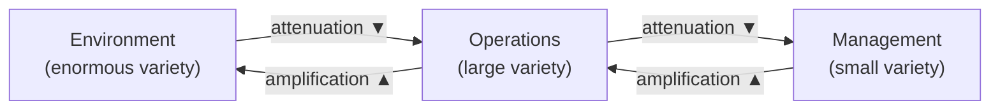
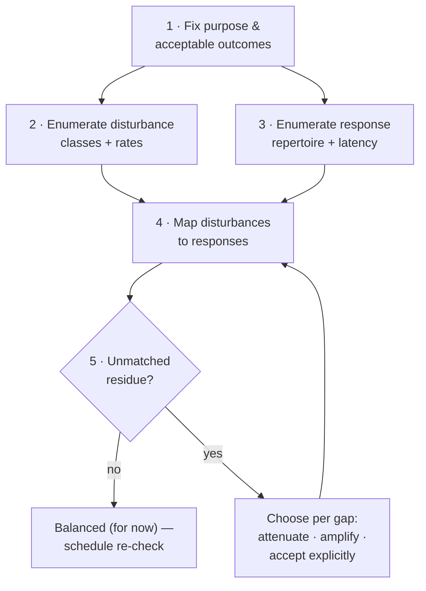

# 05 — Variety Engineering: The Practitioner's Toolkit

> Previous: [04 — Metalanguage and Metasystems](04-metalanguage-metasystems.md) · Next: [06 — Modern Extensions](06-modern-extensions.md)

Requisite variety, as a theorem, tells you *whether* regulation is possible. It says nothing
about *how* to get there. **Variety engineering** — Stafford Beer's term for the deliberate
design of attenuators and amplifiers — is the "how." It is the closest thing management
cybernetics has to an engineering discipline: an inventory of mechanisms, a handful of design
heuristics, and a discipline of accounting for variety the way a structural engineer accounts
for load.

This document is the practitioner's toolkit. It assumes you have read the formal treatment of
Ashby's Law (doc 02) and the VSM overview (doc 03). Here we care about one question only:
*your system is out of balance — what do you actually do?*

---

## 1. The variety balance, informally

Recall the setup. **Variety** is the number of distinguishable states a system can exhibit —
or, when counting gets awkward, the logarithm of that number, measured in bits. Ashby's Law of
Requisite Variety says that a regulator can only restrict the variety of outcomes to the extent
that its own variety matches the variety of the disturbances it faces. In Ashby's own words,
"only variety can destroy variety."

For a manager, an SRE, or a service designer, the informal statement is this:

> **For every situation that matters and demands a distinct response, the responding system must
> actually have a distinct response available — and be able to select and execute it in time.
> Wherever it doesn't, outcomes are decided by the disturbance, not by you.**

The environment always generates vastly more states than any operation can represent, and any
operation generates vastly more states than its management can attend to. Beer drew this as a
chain of unequal blocks:



The inequality is not a design flaw; it is a fact of nature. No help desk can represent every
customer's full situation, and no executive can represent every ticket. The design question is
where and how the inevitable variety reduction happens, and where and how the small regulator's
variety gets multiplied so that it counts as "requisite" *at the point of interaction*.

The working equation, stated loosely:

```
variety reaching the regulator  ≈  variety it can absorb
        (after attenuation)          (after amplification)
```

Beer's principle is that these flows tend to equate whether you design them or not — variety,
like water, finds its level. If you do not choose your attenuators, the system improvises its
own: queues grow, corners get cut, staff burn out, categories collapse into "miscellaneous,"
and customers get ignored. If you do not choose your amplifiers, the amplification happens
anyway in degenerate form: rubber-stamping, rule-of-thumb decisions made without looking.
**Variety engineering is choosing your attenuators and amplifiers on purpose, at low cost,
before the system chooses worse ones for you.**

Two bookkeeping notes before the catalogue:

1. **Variety is counted relative to a purpose.** Two customer emails are "the same state" if
   your purpose does not require distinguishing them. Every variety count in this document is
   implicitly indexed to a stated purpose and a stated set of distinctions. Change the purpose
   and the numbers change.
2. **Counts here are order-of-magnitude proxies, not measurements.** Real state spaces are
   combinatorial and mostly unobservable. The point of a variety accounting table is to expose
   *mismatches and their direction*, not to compute anything to three significant figures.
   Honest variety engineering is Fermi estimation, not metrology.

---

## 2. A catalogue of attenuators

An **attenuator** reduces the variety that reaches a regulator, ideally by discarding
distinctions that do not matter for the purpose at hand. Every attenuator is a bet: *these
distinctions are safe to throw away.* Section 6 covers what happens when the bet is wrong.

| Attenuator | What it does | Everyday examples | What it silently discards |
|---|---|---|---|
| **Aggregation** | Replaces many micro-states with a summary statistic | Monthly revenue instead of every transaction; mean latency instead of every request | Distribution shape, outliers, timing, correlations |
| **Categorization** | Maps an open-ended state space onto a small closed set of classes | Ticket types, ICD codes, bug severity levels | Everything within-class; everything that fits no class |
| **Standardization** | Removes variety at the *source* by constraining what states can occur at all | Form fields instead of free text; container shipping; coding conventions; one laptop model per team | Legitimate nonstandard needs; local optimizations |
| **Delegation / autonomy** | Lets a lower unit absorb variety locally so it never propagates upward | Refund authority up to $200 at the front line; team-owned deploys | Central visibility into individual cases (by design) |
| **Filtering** | Passes only states matching a criterion; drops the rest | Spam filters, alert routing rules, triage queues, inbox rules | False negatives — the filtered-out state you needed |
| **Service-level agreements** | Converts a continuum of possible performance into a binary: in-spec / out-of-spec | "99.9% availability," "first response in 4 h" | All variation inside the spec; the *reasons* for breaches |
| **Exception reporting** | Reports nothing while behavior stays inside limits; only deviations propagate | Budget variance reports, alerting thresholds, control charts | Slow drifts inside the limits; context around the exception |
| **Sampling** | Inspects a subset and infers the rest | QA spot checks, trace sampling at 1%, customer surveys | Rare events; anything correlated with being unsampled |
| **Seasonality / structural models** | Encodes known regularities so only *residuals* need attention | Holiday demand curves, capacity plans, baseline forecasts | Regime changes the model doesn't know about |

Notes worth internalizing:

- **Standardization is the strongest attenuator** because it acts on the disturbance side —
  it prevents variety from being generated rather than absorbing it after the fact. This is
  why forms beat free text and why platform engineering ("paved roads") beats heroic ops.
- **Delegation is attenuation as seen from above.** From headquarters' viewpoint, a
  front-line agent authorized to resolve refunds is an attenuator: a million customer
  situations arrive, and only the exceptions propagate upward. From the customer's viewpoint,
  the same arrangement is an *amplifier* of the organization's responsiveness. Most good
  designs are attenuators in one direction and amplifiers in the other simultaneously.
- **Exception reporting is attenuation with a clock.** It works only if the limits are set
  where deviation actually matters and are revisited when the environment shifts. Stale
  thresholds are how organizations sleep through slow-moving disasters.

---

## 3. A catalogue of amplifiers

An **amplifier** multiplies the effect of a regulator's limited variety, letting one decision,
one person, or one artifact respond adequately to many distinct situations. Where an
attenuator discards distinctions, an amplifier *reuses responses*.

| Amplifier | What it does | Everyday examples | The leverage mechanism |
|---|---|---|---|
| **Policies / rules** | One decision, made once, governs an unbounded class of future cases | Pricing rules, security policy, "we always ship behind a feature flag" | Decide once, apply indefinitely |
| **Automation** | Encodes a response so it executes without consuming human variety | Auto-remediation, CI/CD, password-reset flows, autoscaling | A machine repeats a response at near-zero marginal cost |
| **Templates** | Pre-solves the common structure of a class of outputs | Email macros, contract boilerplate, project scaffolds, runbooks | Only the residual (the blank fields) needs fresh variety |
| **Training** | Installs a repertoire of responses into people ahead of need | Onboarding, drills, apprenticeship, checklists learned to fluency | Responses selected in milliseconds instead of invented in hours |
| **Hierarchy / escalation** | Routes each case to the cheapest level that can absorb it, reserving scarce high-variety attention for the residue | Tiered support, on-call escalation, courts of appeal | Expensive variety touches only pre-filtered cases |
| **Market mechanisms** | Lets prices coordinate responses no central regulator could enumerate | Spot pricing, internal chargeback, auction-based resource allocation | Distributed regulators self-select responses; the price is a one-number channel |
| **APIs / interfaces** | One published contract lets unbounded unknown consumers self-serve | Public APIs, self-service portals, SQL over a warehouse | The provider answers a class of questions without answering any question |
| **Caching / precomputation** | Answers a repeated question once, then replays the answer | CDN caches, FAQs, memoization, knowledge bases | Repeated disturbances collapse into one disturbance |

Notes:

- **Every amplifier is really an attenuator viewed from the other side.** A policy amplifies
  the executive's variety and simultaneously attenuates the organization's behavioral variety.
  This duality is not a pun; it is the central bookkeeping fact of variety engineering. Always
  ask *whose* variety a mechanism amplifies and *whose* it attenuates.
- **Amplification is never free variety.** Ashby's Law is not repealed: a policy handles only
  the class of cases its authors could distinguish when writing it. The variety appears
  requisite because it was *stored earlier* (in the policy, the training, the code) and is
  now being replayed. When the environment presents a case outside the stored repertoire,
  amplifiers fail all at once — see Section 6 on brittleness.
- **Hierarchy is an amplifier of scarce attention, not of wisdom.** Its cybernetic function is
  economic: match each disturbance to the least expensive adequate regulator. When routing
  criteria are wrong, hierarchy amplifies delay instead.

---

## 4. Design heuristics

The catalogue tells you what the parts are. These heuristics tell you which part to reach for.

### 4.1 Attenuate before you amplify

Amplification is expensive and recurring: automation must be maintained, staff must be
trained and retained, policies must be enforced and updated. Attenuation — especially at the
source, via standardization and filtering — is usually cheaper and pays compound interest,
because every downstream mechanism now faces less variety. So work the disturbance side first:

1. Can this variety be **prevented** (standardize the input)?
2. Can it be **absorbed where it arises** (delegate)?
3. Can it be **summarized or filtered** before it travels (aggregate, filter, report by
   exception)?
4. Only then: what amplification does the *residual* variety require?

A team that buys amplification first — more headcount, more tooling — while leaving the
disturbance uncontrolled is bailing a boat without plugging the hole. It can work, but the
bill recurs forever.

### 4.2 Put variety absorption at the lowest capable level

Each disturbance should be terminated by the cheapest regulator that can genuinely absorb it,
as close to its point of origin as possible. This is the cybernetic argument for front-line
autonomy: the agent talking to the customer has more relevant variety about *this case* than
any manager ever will, and escalation destroys exactly the situational detail that made the
right response selectable. Reserve upward escalation for cases where the lower level truly
lacks either the repertoire or the authority — and treat every escalation as a signal that
some repertoire or authority may be missing below.

The corollary is that delegation without capability is abandonment. "Lowest capable level"
has two words in it. Pushing decisions down without pushing down the training, information,
and authority to make them merely relocates the variety deficit and hides it from view.

### 4.3 Match sensor variety to actuator variety

A regulator needs two capacities: to **distinguish** states (sensing) and to **respond
differently** to distinguished states (actuation). It is wasted design to have one greatly
exceed the other:

- **Sensors ≫ actuators:** a dashboard with forty metrics feeding a team that has only two
  possible responses ("do nothing" / "restart it") is mostly decoration. The distinctions are
  collected and then thrown away at the point of action. Worse, unactionable sensing consumes
  the regulator's own capacity — attention spent reading is attention not spent responding.
- **Actuators ≫ sensors:** a team with rich remediation tooling but alerts that only say
  "service degraded" cannot select among its responses. The repertoire exists but the channel
  that should drive selection carries too little variety to address it. (This is the
  practical face of the requirement that the regulation channel have adequate capacity —
  the same constraint that appears formally in doc 02.)

Design them as a pair: for each distinction you sense, name the response it selects; for each
response you can execute, name the observation that would trigger it. Anything unmatched on
either side is a candidate for deletion — or a gap to fill.

### 4.4 Ashby gap analysis

A repeatable procedure for finding where the law is being violated:

1. **Fix the purpose.** What outcomes must stay within what bounds? (Without this, variety is
   uncountable and the analysis is theater.)
2. **Enumerate disturbance classes.** List the kinds of situations that arrive, at the
   granularity at which they *require different responses*. Estimate arrival rates.
3. **Enumerate the response repertoire.** What distinct responses can the regulator actually
   select and execute in time? Include authority limits and latency — a response that arrives
   too late is not in the repertoire.
4. **Map disturbances to responses.** Every disturbance class needs at least one adequate
   response reachable in time.
5. **The unmatched residue is the Ashby gap.** For each gap, choose: attenuate the
   disturbance class out of existence, add a response (amplify), or consciously accept the
   unregulated outcomes and say so out loud.
6. **Re-run periodically.** Environments drift; repertoires rot. A gap analysis is a
   snapshot, not a certificate.



---

## 5. Two worked mini-cases

Both cases use deliberately round numbers. Treat every figure as a Fermi estimate whose job is
to reveal the *direction and rough size* of an imbalance. "States" below means
*distinctions-that-demand-distinct-handling*, per unit time — a purposeful undercount of true
combinatorial variety, which is fine, because the purpose fixes what counts.

### 5.1 Case A: a support desk drowning in tickets

**Situation.** A B2B software company's support desk receives ~500 tickets/day as free-text
email. Six agents each resolve ~30 tickets/day when every ticket is read and answered from
scratch. The backlog grows by ~320 tickets/day; response times are measured in weeks;
customers escalate through sales, which converts a support problem into an executive problem —
unmanaged variety flowing uphill, exactly as Beer predicts.

**Gap analysis (abridged).** Purpose: every ticket receives an adequate response within one
business day. Disturbances: 500/day, effectively all distinct at the free-text level.
Repertoire: 6 × 30 = 180 hand-crafted responses/day. The Ashby gap is glaring: demand for
distinct responses exceeds supply roughly 3:1, so the environment — not the desk — is deciding
outcomes for two of every three tickets.

**Interventions**, chosen attenuation-first:

1. **Standardize intake** (attenuator): replace free-form email with a form: product area,
   symptom category, severity, environment. Analysis of a sample shows ~80% of tickets fall
   into 12 recurring categories.
2. **Deflect the repeatable** (amplifiers: knowledge base + automation): the top 3 categories
   (password/access, billing questions, a known configuration pitfall) get self-service
   articles and an automated reset flow. Measured deflection: ~150 tickets/day never arrive.
3. **Template the common** (amplifier): the remaining 9 recurring categories get response
   macros; agent throughput on those rises from ~30 to ~70/day because only the residual
   (the customer-specific blanks) consumes fresh attention.
4. **Delegate resolution authority** (attenuator upward, amplifier outward): agents may issue
   credits up to $200 without approval, eliminating an escalation loop that had added a day
   of latency and consumed a manager's attention on ~20 cases/day.
5. **Report by exception** (attenuator): management stops reviewing ticket lists and instead
   receives only SLA breaches and a weekly category-mix summary — which is also the sensor
   that detects when a new disturbance class emerges (a growing "other" bucket).

**Variety accounting.**

| Quantity (per day, order-of-magnitude) | Before | After |
|---|---:|---:|
| Disturbances generated by customers | ~500 unique free-text tickets | ~500 situations (unchanged — the environment didn't change) |
| … removed at source (self-service, automation) | 0 | ~150 |
| … arriving pre-categorized into 12 classes | 0 | ~280 |
| … arriving as genuine novelty ("other") | ~500 (everything treated as novel) | ~70 |
| Response capacity: templated handling | 0 | ~280 (4 agents × ~70) |
| Response capacity: bespoke handling | 180 (6 agents × 30) | ~60 (2 agents × 30) |
| **Residual gap (unabsorbed variety)** | **~320/day, compounding** | **≈ 0 at expected load; ~10/day headroom** |
| Variety reaching management | ~20 escalations + growing backlog + irate sales channel | Exception reports only (SLA breaches, category drift) |

The disturbance variety never decreased — customers have the same problems they always had.
What changed is *where each class of variety is absorbed*: at the source (deflection), at
intake (categorization), at the front line (templates, authority), leaving bespoke human
attention — the scarcest, highest-variety resource — for the ~70 genuinely novel cases it is
uniquely able to absorb.

**Caveat honestly stated:** intervention 1 is a bet that the 12 categories carve the ticket
space at its joints. The weekly category-mix report exists precisely because that bet decays —
see Section 6.

### 5.2 Case B: an on-call rotation

**Situation.** A platform team of 8 engineers runs a one-person weekly on-call. Monitoring
emits ~200 pages/week. Post-hoc review shows ~85% are noise (flapping thresholds, duplicate
alerts from one underlying cause, non-actionable warnings). Each page costs attention and,
at night, sleep; the on-call engineer's effective diagnostic variety collapses precisely when
a real incident needs it most. Two SEV-1s in a quarter were acknowledged late because the
responder had learned — rationally — to distrust the pager. This is unengineered attenuation:
the human nervous system supplied the filter that the alerting design refused to.

**Gap analysis (abridged).** Purpose: real incidents acknowledged in ≤ 5 minutes and
mitigated by an adequate response. Disturbances: ~200 pages/week, of which ~30 represent
real, distinct incident conditions. Repertoire: one tired engineer's recall, plus tribal
knowledge unevenly distributed across 8 heads. Sensor variety is *inflated* (200 signals for
30 conditions — negative information, in effect), while actuator variety is thin and
unevenly stored.

**Interventions:**

1. **Deduplicate and aggregate** (attenuator): correlate alerts so one underlying fault pages
   once, not eight times. −60 pages/week.
2. **Alert on symptoms, not causes** (attenuator, via an SLO model): page only when a
   user-facing service-level objective is threatened; demote cause-level signals (CPU, queue
   depth) to dashboards consulted *after* a symptom page. This is the seasonality-model
   pattern: encode what "normal" looks like so only meaningful residuals propagate.
   −80 pages/week.
3. **Severity categorization** (attenuator): remaining signals classed P1 (page now) /
   P2 (business hours) / P3 (weekly review). Nighttime variety drops to genuine emergencies.
4. **Runbooks for the recurring** (amplifier: templates + training): the ~12 recurring
   incident types each get a tested runbook; quarterly game-days drill them. The 3 a.m.
   response draws on the *team's* stored variety, not one individual's depleted recall.
5. **Auto-remediation for the fully understood** (amplifier: automation): 4 incident types
   (disk-full rotation, stuck consumer restart, cert renewal, failover for one known flaky
   dependency) are automated with the runbook as specification; the page becomes an FYI.
6. **Escalation policy** (amplifier: hierarchy): a defined secondary and an incident-commander
   path mean the primary's repertoire is bounded by the *team's* variety, not their own, with
   a known latency cost.

**Variety accounting.**

| Quantity (per week, order-of-magnitude) | Before | After |
|---|---:|---:|
| Raw signals emitted by monitoring | ~200 | ~200 internally; ~35 cross the paging threshold |
| … duplicates / noise reaching a human | ~170 | ~5 |
| … real incident conditions | ~30 | ~30 (unchanged — the failure modes didn't change) |
| … absorbed by automation | 0 | ~12 |
| … absorbed via runbook by primary | 0 (ad-hoc recall) | ~15 |
| … requiring novel diagnosis | ~30 (all of them, in effect) | ~3 |
| Effective responder variety at 3 a.m. | One person's depleted recall | Runbooks + drilled team + escalation path |
| Signal-to-noise at the pager | ~0.15 | ~0.85 |
| **Residual gap** | Real incidents lost in noise; late SEV-1 acks | ~3 novel incidents/week absorbed by escalation |

Notice the sensor/actuator rebalancing (heuristic 4.3): before, sensing variety was
pathologically high relative to actuation (200 indistinguishable-urgency signals, one
improvised response mode); after, each page class maps to a named response — a runbook, an
automation, or an escalation. The distinctions that survive attenuation are exactly the ones
that select different actions.

**Caveat honestly stated:** intervention 2 deliberately blinds the pager to cause-level
signals. A slow disk filling over three weeks now pages nobody until the SLO wobbles. That is
a chosen trade — accepted explicitly in step 5 of the gap analysis and backstopped by the P3
weekly review — not a free lunch.

---

## 6. Failure modes

Every mechanism above can be installed wrongly, and the failures are systematic enough to
name.

### 6.1 Attenuation that destroys signal

Every attenuator embodies a bet about which distinctions are disposable, and the bet is placed
*when the attenuator is designed*, against the environment as it was then. Environments drift;
attenuators don't, unless forced. Characteristic forms:

- **Aggregation hiding structure.** The mean is on target while the tail is on fire. A 99.9%
  availability figure can conceal that all failures hit one region, one customer, one hour.
- **Category rot.** The taxonomy was carved for last year's ticket mix. Novel problems get
  shoehorned into old classes and inherit old (wrong) responses; the "other" bucket — the
  system's only sensor for novelty — is the first thing a tidy-minded administrator deletes.
- **Filter false negatives.** The one alert that mattered matched the noise signature.
  Filters are silent about what they discard, which is precisely why they need audits.
- **Threshold anesthesia.** Exception reporting with stale limits reports no exceptions while
  the system drifts to the cliff edge inside them.

The general defense is to **instrument the attenuator itself**: sample what it discards, watch
the residual buckets, and schedule revisions. An unexamined attenuator degrades into a device
for not knowing things.

### 6.2 Amplification that creates brittleness

Amplifiers replay stored responses, so they concentrate a single design decision across many
future cases. That is the leverage — and the failure mode:

- **Automation at scale is error at scale.** A wrong auto-remediation executes its mistake
  faster and more uniformly than any human could, and a fleet standardized on one
  configuration fails as one machine. Monocultures trade many small independent failures for
  rare correlated ones.
- **Policy overhang.** Rules written for a vanished environment continue amplifying obsolete
  decisions; because compliance is legible and judgment is not, organizations often keep
  amplifying long after the stored decision went stale.
- **Deskilling.** Templates and automation absorb the routine cases that were, invisibly, the
  training ground for the hard ones. The stored variety in *people* quietly evaporates, and
  when the amplifier meets an out-of-repertoire case, the fallback regulator no longer exists.
  (This is one reason the on-call design above keeps game-days: drills are amplifier
  maintenance for humans.)

The general defense is to keep a **manual path** alive and exercised, budget for amplifier
maintenance as a recurring cost (it is one), and treat every out-of-repertoire case as a
design input rather than an annoyance.

### 6.3 Goodhart effects

Attenuators built for *measurement* have a special pathology: the moment a summary statistic
is used as a target, the system being measured starts generating states chosen to look good
under the summary — the correlation between the proxy and the purpose is destroyed by the act
of optimizing the proxy. In variety terms: **a metric is a low-variety channel, and any agent
with more variety than the metric can satisfy the channel without satisfying the purpose.**
The regulated system almost always has more variety than the metric. Familiar shapes:

- Close-rate targets → tickets closed and reopened, or closed as "no response" at 4:59 p.m.
- First-response SLAs → instant boilerplate acknowledgments that buy the clock and help no one.
- Alert-count reduction goals → thresholds raised until the pager is quiet and blind.
- Incident-count targets → SEV-2s that are, upon reflection, filed as SEV-3s.

Note what happened in each case: a mechanism installed as an *attenuator for observers* was
repurposed as an *amplifier of incentive*, and the gamed response propagated everywhere the
incentive reached. Beer's aphorism is the right diagnostic lens here — "the purpose of a
system is what it does." If what it does is optimize the proxy, that is its purpose now,
whatever the slide deck says.

Defenses are partial at best: pair every target with a counter-metric that gets worse under
the obvious gaming strategy; keep some measurements unlinked from consequences; rotate and
audit metrics; and go look at raw cases on a sample basis — that is, deliberately bypass your
own attenuators at intervals. There is no closed-form fix, because Goodhart dynamics are
themselves an instance of Ashby's Law: the measured system out-varieties the measure. The
honest engineering posture is to expect it, detect it early, and redesign often.

---

## 7. Summary

- The variety balance is not optional; it will be struck with or without you. Variety
  engineering means choosing the attenuators and amplifiers deliberately, at design time, at
  low cost — instead of letting queues, burnout, and neglect strike the balance for you.
- Attenuators (aggregation, categorization, standardization, delegation, filtering, SLAs,
  exception reporting, sampling, structural models) discard distinctions; each one is a
  standing bet that those distinctions don't matter. Instrument the bet.
- Amplifiers (policies, automation, templates, training, hierarchy, markets, APIs, caching)
  replay stored variety; each one is a standing bet that the stored repertoire still fits the
  environment. Maintain the repertoire, and keep a manual path warm.
- Heuristics: attenuate before you amplify; absorb variety at the lowest capable level; match
  sensors to actuators; and run an explicit Ashby gap analysis rather than trusting intuition
  about balance.
- Variety accounting with rough numbers is respectable engineering; variety accounting with
  false precision is not. The tables exist to expose direction and magnitude of imbalance
  under a stated purpose — nothing more, and nothing less is needed.

---

## Sources

- W. Ross Ashby, *An Introduction to Cybernetics* (1956) — the Law of Requisite Variety and
  the underlying formal machinery.
- W. Ross Ashby, *Design for a Brain* (1952; 2nd ed. 1960) — adaptation and regulation in
  state-determined systems.
- Roger C. Conant and W. Ross Ashby, "Every good regulator of a system must be a model of
  that system," *International Journal of Systems Science* (1970) — why regulators must
  internally mirror what they regulate; the formal backing for "sensor/actuator matching."
- Stafford Beer, *Brain of the Firm* (1972; 2nd ed. 1981) — the Viable System Model and
  variety flows between environment, operations, and management.
- Stafford Beer, *Designing Freedom* (1974) — the accessible statement of variety
  attenuation and amplification in social systems.
- Stafford Beer, *The Heart of Enterprise* (1979) — variety engineering developed at length,
  including the tendency of variety flows to equate and the design of homeostatic balances.
- Stafford Beer, *Diagnosing the System for Organizations* (1985) — the practitioner-oriented
  workbook treatment of variety balances in the VSM.
- Claude E. Shannon, "A Mathematical Theory of Communication," *Bell System Technical
  Journal* (1948) — channel capacity, the formal substrate for counting variety in bits.
- Charles A. E. Goodhart, "Problems of Monetary Management: The U.K. Experience" (1975) — the
  original context of what is now called Goodhart's Law.
- Marilyn Strathern, "'Improving Ratings': Audit in the British University System," *European
  Review* (1997) — source of the common phrasing that a measure that becomes a target ceases
  to be a good measure.
