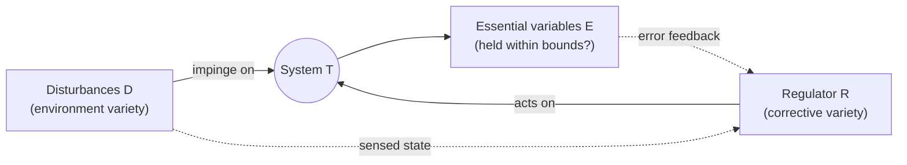
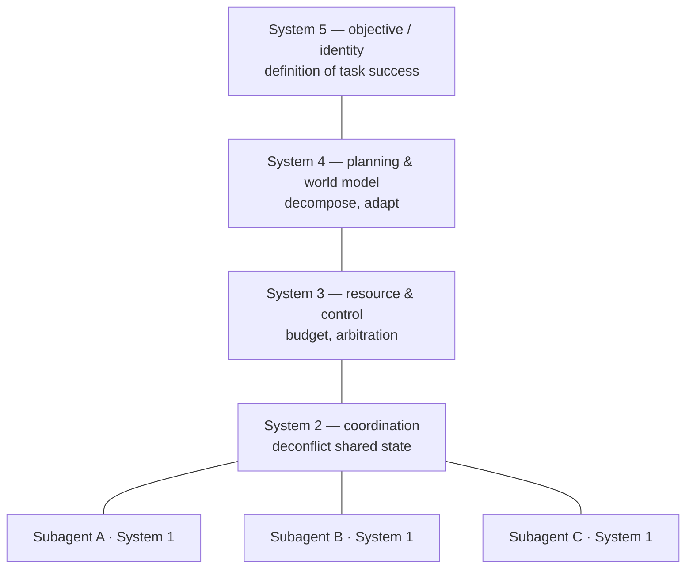

# 06 · Modern extensions — requisite variety in the 2020s

> This is the repository's original-contribution essay. Earlier docs built the
> machinery (Ashby's Law of Requisite Variety, the essential-variables picture,
> Beer's Viable System Model and variety engineering). Here we put that machinery
> to work on four systems that did not exist, or barely existed, when Ashby and
> Beer wrote: LLM agent stacks, modern SRE/platform engineering, internet-scale
> content moderation, and the daily reality of knowledge work under an information
> firehose.
>
> A warning up front about **rigor level**. Ashby's law is a genuine theorem for
> systems whose states you can enumerate. None of the four domains below hand you
> a clean state-count. So treat what follows as *applied interpretation*: the law
> supplies a directional constraint and a vocabulary that sharpen otherwise fuzzy
> arguments, not a set of numerical predictions. Where the interpretation is
> loosest, the essay says so out loud.

---

## The instrument, in one page

Ashby's setup has three objects. A source of **disturbance** `D` pushes a system
away from where we want it. An **essential-variable set** `E` names the outcomes
that must stay within acceptable bounds (temperature in range, the account not
overdrawn, the service not down). A **regulator** `R` sits in the loop and issues
corrective moves. Write `V(·)` for *variety* — the count of distinguishable states
of a thing, or its logarithm in bits.

Ashby's **Law of Requisite Variety** bounds how well any regulator can do:

```
V(E) ≥ V(D) − V(R)        (variety, in bits / logarithms)
```

The residual variety that leaks into the outcomes is at least the disturbance
variety minus whatever variety the regulator can muster. To pin the outcome to a
single acceptable state against *every* disturbance — perfect regulation — the
regulator needs `V(R) ≥ V(D)`. Ashby's compression of this: **"only variety can
destroy variety"** (Ashby, 1956). A regulator with fewer distinct responses than
the world has disturbances *must* let some disturbances through; no cleverness
repeals the count.



Two corollaries do most of the work in this essay:

- **Variety engineering (Beer).** If you cannot win the inequality by brute force,
  engineer both sides. **Attenuate** `D` (filter, standardize, reduce the incoming
  distinctions that reach the regulator) and **amplify** `R` (tools, delegation,
  automation that multiply the regulator's reach). Beer's insight for management
  was that this balancing happens *whether or not you design it* — unmanaged
  imbalance simply resurfaces as cost, instability, or loss of control.
- **The good-regulator theorem (Conant & Ashby, 1970).** Every good regulator of a
  system must contain a *model* of that system. Matching variety is not enough; the
  regulator's responses have to be organized to mirror the disturbances they answer.
  This is why "add more rules" and "add a model" are different moves, and why the
  second scales where the first does not.

**Reading protocol.** For each domain we (1) name `D`, `R`, and `E` precisely,
(2) derive one non-obvious prediction the law forces, and (3) state honestly where
the analogy strains.

---

## 1 · LLM agent systems

| Object | In an agent stack |
| --- | --- |
| `D` — disturbance | The open-ended space of inputs and world-states the agent meets: natural-language requests, tool outputs, retrieved documents, the live state of systems it acts on, and adversarial inputs deliberately crafted to be out-of-distribution. |
| `E` — essential variables | The acceptable-behavior set: task solved correctly, no policy violation, within cost/latency/permission budgets. |
| `R` — regulator | The agent's capacity to emit an *appropriate distinct* response. Its variety is assembled from four sources: the model weights (the learned policy), the **context window** (situational/sensory variety), **tool access** (effector variety), and the **guardrail layer** (a bolt-on attenuator). |

**Context and tools are variety amplifiers.** The context window raises `V(R)` on
the *input* side: by conditioning on more of the specific situation, the regulator
can distinguish more disturbance states and answer them differentially — exactly
the discriminating power Ashby's regulator needs. Tool use raises `V(R)` on the
*effector* side: search, code execution, and API calls widen the set of
distinguishable actions the agent can take in the world. Both are Beer-style
amplification: a modest core policy plus amplifiers can meet a disturbance set far
larger than the policy alone could cover.

**Guardrails are attenuators**, and they act on two different channels. Input
filters attenuate `D` before it reaches the core model; output filters and refusal
policies attenuate the *outcome* channel, collapsing a wide band of would-be
responses down to "refuse." Both are low-variety regulators bolted across a
high-variety flow.

**The supervisor/subagent pattern is a metasystem.** Map it onto the VSM. Each
subagent is a **System 1** — an operational unit that is itself a viable agent with
its own context and tools. The orchestrator supplies the metasystem the subagents
cannot supply for themselves: **System 2** coordination (stop two subagents from
clobbering the same file or oscillating), **System 3** resource control (who gets
budget, here-and-now arbitration), **System 4** planning and world-modeling
(decompose the task, adapt), and **System 5** identity (what "done well" means).
Recursion holds: the whole agent stack is a System 1 inside the human organization
that deploys it.



**Alignment is a requisite-variety problem: a fixed rulebook cannot regulate an
open-ended optimizer.** This is the sharpest claim in the section, and it is close
to a theorem rather than a metaphor. An open-ended optimizer generates strategies
from an effectively unbounded set; a fixed rulebook (a constitution, a static
policy list, a hardcoded filter) has bounded variety. By Ashby, a bounded regulator
facing an unbounded disturbance set must leak — there will always be strategies the
rules did not anticipate, which is precisely the phenomenon of specification gaming
and reward hacking (Amodei et al., 2016). Conant & Ashby sharpen the point: to
regulate the optimizer well, `R` must *model* it — and to model an open-ended
optimizer, the regulator must itself be nearly as rich as the thing it regulates.
That is why the field's trajectory runs from static filters toward *adaptive*
regulators (learned reward models, model-based classifiers, a model judging another
model, scalable oversight): you cannot answer variety with a list, only with more
variety.

**Prediction (non-obvious).** Robustness to jailbreaks will not come from
enumerating forbidden inputs. Each static rule covers a bounded slice of
disturbance space while adversarial input variety composes and grows faster, so the
marginal jailbreaks-blocked-per-rule *decays*. The durable move is to attenuate the
**effector** channel, not the input channel: constrain what an agent can *do*
(sandboxes, capability scoping, permissioned tools) rather than enumerate what it
must not *say or think*. The action space is smaller and far more enumerable than
the space of natural-language strategies, so an effector-side attenuator can
approach `V(R) ≥ V(D)` where an input-side one never can. Concretely: two systems
with identical models, one hardening the prompt/output filter and one hardening the
tool sandbox, will diverge — the sandboxed one degrades gracefully under novel
attacks while the filtered one fails discontinuously. A second prediction falls out
directly: **adding tools without correspondingly raising the metasystem's
regulatory variety (monitoring, permissions, arbitration) raises the rate of
high-severity failures**, because you have amplified the regulator's reach faster
than your ability to keep its outcomes inside `E`. Variety has to be matched on
both sides of the loop, not just the capable side.

**Where it strains.** Ashby's variety is a count over a defined set; LLM behavior
space is not cleanly enumerable and "variety in bits" is not directly measurable
for open text. Worse, `D` and `R` are not independent: an agent partly *creates its
own future inputs* by acting, so the tidy disturbance-column / regulator-row table
becomes a closed loop the theorem does not cover. And `E` — the acceptable set — is
itself contested and underspecified for alignment. So the law delivers a
directional impossibility ("no fixed finite rulebook suffices") and a design
compass, but no numeric safety threshold.

---

## 2 · SRE and platform engineering

| Object | In production operations |
| --- | --- |
| `D` — disturbance | Everything that can perturb the service: traffic spikes, bad deploys, hardware faults, dependency outages, cascading failures — heavy-tailed and combinatorial. |
| `E` — essential variables | The SLOs: latency, error rate, and availability kept inside agreed bounds. |
| `R` — regulator | On-call engineers plus automation (autoscaling, circuit breakers, automated rollback), runbooks, and control loops — the set of distinct corrective responses the team-plus-machinery can produce. |

**Error budgets are honesty about `V(E)`.** The law says you cannot drive residual
outcome variety to zero against an unbounded, evolving `D` with finite `R`. An
error budget encodes exactly this: it *permits* a nonzero, bounded amount of leaked
variety in `E`. Chasing 100% reliability is chasing `V(R) → ∞`, which the law
tells you is unaffordable; the budget is the engineering admission that some
disturbance will get through and a decision about how much (Beyer et al., 2016).

**Alert fatigue is variety overload on the regulator's channel.** Monitoring is the
sensor channel feeding `R`. If it transmits too much variety — every anomaly
becomes a page — it exceeds the human regulator's channel capacity, and the
regulator's *effective* variety collapses toward zero (an ignored page produces no
differential response). Good alerting is a variety **attenuator tuned to `R`'s
capacity**: it maps many raw signal-states onto a few actionable classes.
Alert fatigue is a mis-tuned attenuator passing more than the regulator can convert
into action.

**Runbooks vs. judgement is the anticipated-variety / novel-variety split.** A
runbook is a fixed regulator — an enumerated table of disturbance → response. It
handles the high-frequency, low-variety head of the distribution cheaply and
reliably (System 1/2/3, here-and-now regulation of *known* variety). The
heavy-tailed novel incident exceeds the runbook's variety and demands human
judgement — a high-variety adaptive regulator, i.e. **System 4** answering the
unmodeled. Healthy operations need both; a shop that has only runbooks is blind to
its own tail, and a shop that has only heroics never captures its head.

**Observability is sensor variety, and it is a modeling requirement.** High-
cardinality traces and events raise the regulator's power to *distinguish*
disturbance states. By Conant & Ashby, to regulate the system you must model it;
observability is how `R` builds and continuously updates that model. Low-cardinality
metrics collapse distinct failure states into one indistinguishable blob, so the
regulator cannot respond differentially — structural under-regulation no runbook can
fix.

**Prediction (non-obvious).** Mean-time-to-recovery as a function of alert volume is
**U-shaped, not monotone.** Too few alerts blinds the regulator; too many destroy
its effective variety through saturation. So a team that *halves* its alert volume
can *improve* incident response — an outcome that looks paradoxical ("less
information, faster recovery") but is a direct reading of Ashby's channel-capacity
constraint on `R`. A companion prediction: **observability investment shows
diminishing returns unless matched by response variety.** You cannot regulate what
you can only see; teams that add dashboards without adding automation, runbooks, or
the *authority to act* will watch MTTR plateau while their sensor budget keeps
climbing.

**Where it strains.** SLOs and budgets are negotiated, not derived from a state-
count. `D` is non-stationary — every deploy invents new failure modes, so `V(D)` is
not fixed. Regulator and disturbance are coupled (the incident is often caused by
the org's own change). And decisively, Ashby's law says nothing about **latency**:
it assumes the regulator perceives the disturbance in time to answer it, whereas
many real failures propagate faster than the control loop. In practice the binding
constraint is often loop speed, which the variety inequality does not see.

---

## 3 · Content moderation and institutions

| Object | In platform governance |
| --- | --- |
| `D` — disturbance | Harmful or violating content and behavior — spam, abuse, coordinated manipulation, novel evasion — generated by an **adaptive adversary** actively searching for the regulator's blind spots. |
| `E` — essential variables | Platform health: user safety, trust, legal compliance, advertiser confidence. |
| `R` — regulator | Policy (rules), classifiers, human review, and the enforcement actions available — distinct responses times the ability to tell cases apart. |

**Why static policy loses to adversarial variety.** This is the SRE story with a
malicious twist. In operations, `D` is heavy-tailed but indifferent; in moderation,
`D` is produced by an opponent who *deliberately amplifies variety* aimed at your
gaps. A static policy is a fixed-variety regulator; the adversary manufactures new
disturbance faster than the policy updates. Ashby then guarantees leakage, and the
game-theoretic version tightens it into a **rate condition**: the regulator must
*generate new variety at least as fast as the adversary does*, not merely possess a
large stock of it. "Only variety can destroy variety" here means you cannot beat an
adaptive opponent with a list — you need an adaptive regulator (learning
classifiers, human judgement, rapid policy iteration) whose variety-production rate
keeps pace, and which models the adversary (Conant & Ashby) closely enough to
anticipate the next move rather than only the last.

**Legitimacy is amplification.** This is the section's subtle institutional claim.
A moderator has bounded direct enforcement variety — it cannot inspect everything.
**Legitimacy** — being accepted as a rightful authority whose rules deserve
compliance — is a variety amplifier that works by attenuating `D` *at the source*:
most of the population regulates itself, so the institution only has to answer the
residual (Tyler, 1990). This is Beer's move in social form: rather than raising the
regulator's own variety to match every disturbance, you recruit the regulated agents
to constrain their own variety through norms, reputation, and procedural fairness.
An **illegitimate** regulator loses the amplifier and must confront the full
disturbance variety head-on with only its direct enforcement capacity — which Ashby
says is insufficient. This is why heavy-handed-but-illegitimate control is brittle:
it corrodes the very amplifier it most needs. In VSM terms, legitimacy is a
**System 5** function (identity, ethos, the right to set policy) providing cohesion;
its loss is a System 5 failure that no amount of System 1 enforcement can buy back.
Beer's dictum that **"the purpose of a system is what it does"** (Beer, 1985) cuts
sharply here: a moderation regime is judged by its realized effects, not its stated
rules, and a population reads that realized behavior when deciding whether to comply.

**Prediction (non-obvious).** A dollar spent on **procedural legitimacy**
(transparent, consistent, appealable enforcement) buys more effective moderation at
scale than the same dollar spent on classifier accuracy. Legitimacy attenuates
disturbance at the source, *multiplicatively across the whole population*;
classifiers only raise regulator variety, *additively* and always one step behind
the adversary. The falsifiable edge: **a platform that erodes perceived legitimacy —
opaque, arbitrary, or inconsistent enforcement — will see violation rates rise even
while its classifiers measurably improve**, because the amplifier is decaying faster
than the regulator is strengthening. And under static policy, cost-per-unit-content
moderated rises over time; only regime changes that recruit the population's own
variety (legitimacy, federation, community moderation) bend that curve.

**Where it strains.** This is the loosest of the four analogies, and it should be
flagged as such. "Variety" of harm is not measurable in bits; legitimacy is a
social construct, not a state-count, and the "amplification" it provides is a
behavioral/economic multiplier stronger and messier than Ashby's technical sense.
`E` — what counts as harm — is value-laden and contested, so regulator and
disturbance may not even agree on the target set. Requisite variety is a powerful
*lens* on institutional brittleness, not a theorem you can evaluate here.

---

## 4 · Personal knowledge work

| Object | In an individual's work life |
| --- | --- |
| `D` — disturbance | The inflow: email, chat, notifications, feeds, requests, and the near-infinite menu of things one *could* do — massively amplified by modern tools. |
| `E` — essential variables | The few outcomes that actually matter: the important work advancing, direction held, wellbeing intact. |
| `R` — regulator | Attention and decision-making — a channel whose capacity (working memory, focus, hours) is roughly *fixed*. |

**Attention is the scarce regulator.** Rearrange the law: `V(E) ≥ V(D) − V(R)`.
Information tools have driven `V(D)` up by orders of magnitude while `V(R)` —
biological attention — is close to fixed. The inequality then forces `V(E)` up:
residual variety in outcomes rises, which is the lived experience of loss of control
— priorities blur, commitments slip, the day turns reactive. Herbert Simon saw the
mechanism in 1971: an abundance of information consumes the attention of its
recipients, so attention becomes the binding scarce resource (Simon, 1971). Because
you cannot amplify the regulator much, the entire productivity canon reduces to
**variety engineering aimed almost entirely at the disturbance side**: filter,
unsubscribe, batch, delegate, and say no attenuate `D`; note systems and agents act
as regulator amplifiers — Conant-and-Ashby-style *models of your own commitments*
that let a fixed-attention human meet a larger disturbance set. Delegation is the
VSM recursion: you move toward System 4/5 (direction, identity) and hand System 1
(the doing) to teammates or agents precisely because you cannot hold requisite
variety alone.

**Prediction (non-obvious).** Tools that *raise intake* — more feeds, more
dashboards, a faster inbox — without a matching attenuator will **reduce effective
output**, because they lift `V(D)` against a fixed `V(R)`: the same U-shape as
alerting in Section 2, now inside one head. It follows that the highest-leverage
personal intervention is not a better capture-and-process tool (which marginally
raises the throughput of a fixed regulator) but an **aggressive attenuator**
(ruthless filtering, declining, narrowing) — because attenuating `D` is
cheap-and-unbounded while amplifying attention is capped. Measurably: past some
point, "productivity" tooling that increases intake shows up as *more* time in
triage and *less* in deep work. And delegation/agents pay off only while the
**coordination cost** (the System 2/3 variety needed to manage the delegates) stays
below the variety they absorb; beyond some team-or-agent count the metasystem
overhead exceeds the operational variety gained — a requisite-variety restatement of
why adding people to a late project can slow it down.

**Where it strains.** Attention is not a clean scalar channel: human capacity is
variable and context-dependent, and it can be *restructured* — expertise chunks many
raw distinctions into one, raising effective variety in a way Ashby's fixed count
does not model. `E` is self-defined and shifting. And the disturbance is partly
self-generated — we *seek* the distraction — so regulator and disturbance are not
independent inputs. As everywhere in this essay, the law is a sharp lens on the
trade-offs, not a gauge you can read off.

---

## Cross-cutting pattern

The same three failure signatures recur across all four domains, which is the real
payoff of the framework:

1. **Amplify one side, forget the other, and control degrades.** More tools without
   more oversight (agents); more sensors without more response (SRE); more intake
   without more filtering (knowledge work). Requisite variety is a *balance*
   condition, and one-sided investment reliably backfires.
2. **A fixed list cannot regulate an open or adaptive source.** Rulebooks vs.
   optimizers, runbooks vs. novel incidents, static policy vs. adversaries. The
   escape is always the same: replace the list with a *model* that generates variety
   (Conant & Ashby), and — against an adversary — make sure it generates that variety
   *fast enough*.
3. **The cheapest requisite variety is bought by attenuating the disturbance at its
   source**, not by inflating the regulator. Effector sandboxes, alert tuning,
   legitimacy, and saying no are all the same move in different clothes.

---

## Open problems

The framework is generative, but applying it to modern systems exposes real gaps —
some technical, some genuinely unsolved.

1. **Measurement.** Variety is defined for enumerable state sets. Can we
   operationalize it — as input/output entropy, or some behavioral measure — well
   enough to make the law *quantitative* rather than merely directional in these
   domains? For LLM behavior in particular there is no accepted bits-measure of
   "variety," so the inequality stays qualitative.
2. **A rate form of the law.** Ashby's theorem is static: a fixed table, a
   one-shot game. The interesting modern cases (adversarial moderation, non-
   stationary production systems, self-improving agents) need a *dynamic* statement
   — "the regulator must produce variety at least as fast as the disturbance
   grows." That rate condition is folklore; it lacks Ashby's crisp proof.
3. **Coupling and closed loops.** Ashby assumes disturbance and regulator are
   independent inputs to the outcome. Agents shape their own inputs; orgs cause their
   own incidents; people seek their own distractions. When independence fails, what
   replaces the bound? There is no clean successor theorem.
4. **The good-regulator paradox for AI safety.** Conant & Ashby imply an aligned
   regulator must *model* the optimizer it governs — hence be nearly as capable as
   the thing we are trying to make safe. Yet we want the regulator simpler and more
   trustworthy than the optimizer. Is requisite-variety alignment therefore self-
   undermining? This tension is live and unresolved, not a settled result.
5. **A theory of amplification.** Beer's "amplify the regulator, attenuate the
   disturbance" is a design heuristic with no general account of *how much* a given
   mechanism buys, or of when an amplifier becomes a new disturbance source (a tool
   that adds variety it cannot control). Legitimacy-as-amplifier especially has no
   formal model.
6. **Conservation of variety.** Beer suggested that suppressed variety does not
   vanish — it reappears elsewhere (the attenuated complexity resurfaces as shadow
   work, workarounds, or brittleness). Whether there is a genuine *conservation law*
   for variety across a system boundary, or only a useful intuition, remains
   contested and informal.

Read charitably, requisite variety is less a calculator than a **diagnostic
grammar**: it tells you where to look (which side of the loop is under-provisioned),
what question to ask (is the regulator a list or a model?), and which cheap move to
try first (attenuate the source). That it keeps earning its keep on systems its
authors never imagined is the strongest evidence that the underlying constraint is
real.

---

## Sources

Primary cybernetics:

- W. Ross Ashby. *An Introduction to Cybernetics.* Chapman & Hall, 1956. (Law of
  Requisite Variety, ch. 11.)
- W. Ross Ashby. *Design for a Brain: The Origin of Adaptive Behaviour.* 2nd ed.,
  Chapman & Hall, 1960. (Essential variables; ultrastability.)
- Roger C. Conant and W. Ross Ashby. "Every Good Regulator of a System Must Be a
  Model of That System." *International Journal of Systems Science* 1(2), 1970.
- Stafford Beer. *Brain of the Firm.* 2nd ed., John Wiley & Sons, 1981. (Viable
  System Model.)
- Stafford Beer. *The Heart of Enterprise.* John Wiley & Sons, 1979. (Variety
  engineering.)
- Stafford Beer. *Diagnosing the System for Organizations.* John Wiley & Sons, 1985.
- Claude E. Shannon. "A Mathematical Theory of Communication." *Bell System
  Technical Journal* 27, 1948. (Entropy grounding for variety.)
- Norbert Wiener. *Cybernetics: Or Control and Communication in the Animal and the
  Machine.* MIT Press, 1948.

Domain sources:

- Dario Amodei, Chris Olah, Jacob Steinhardt, Paul Christiano, John Schulman, and
  Dan Mané. "Concrete Problems in AI Safety." arXiv:1606.06565, 2016. (Specification
  gaming and reward hacking.)
- Betsy Beyer, Chris Jones, Jennifer Petoff, and Niall Richard Murphy, eds. *Site
  Reliability Engineering: How Google Runs Production Systems.* O'Reilly, 2016.
  (SLOs and error budgets.)
- Tom R. Tyler. *Why People Obey the Law.* Yale University Press, 1990. (Legitimacy
  and voluntary compliance.)
- Tarleton Gillespie. *Custodians of the Internet: Platforms, Content Moderation,
  and the Hidden Decisions That Shape Social Media.* Yale University Press, 2018.
- Herbert A. Simon. "Designing Organizations for an Information-Rich World." In
  Martin Greenberger, ed., *Computers, Communications, and the Public Interest.*
  Johns Hopkins University Press, 1971. (Attention as the scarce resource.)
